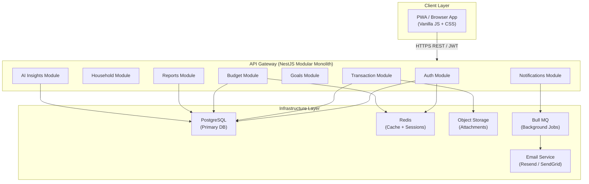
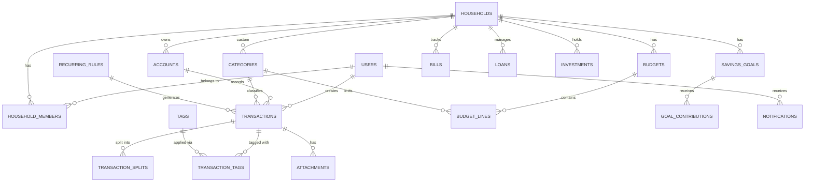

# Personal & Household Budget Tracking Application
## Complete Product Plan & Technical Design Document

> **Role**: Senior Product Manager · Software Architect · UX Designer · Full-Stack Engineer  
> **Date**: June 2026  
> **Status**: Draft — Awaiting Review

---

## Table of Contents

1. [Product Vision](#1-product-vision)
2. [User Personas](#2-user-personas)
3. [Functional Requirements](#3-functional-requirements)
   - [3A. Budget Visualization Design](#3a-budget-visualization-weekly--monthly--yearly)
   - [3B. Category Management Design](#3b-category-management-design)
4. [User Stories](#4-user-stories)
5. [Database Design](#5-database-design)
6. [Application Architecture](#6-application-architecture)
7. [Backend Design](#7-backend-design)
8. [Frontend Design](#8-frontend-design)
9. [Reporting & Analytics](#9-reporting--analytics)
10. [AI Features](#10-ai-features)
11. [Security & Privacy](#11-security--privacy)
12. [API Design](#12-api-design)
13. [Development Roadmap](#13-development-roadmap)
14. [Testing Strategy](#14-testing-strategy)
15. [Deployment Strategy](#15-deployment-strategy)
16. [Technology Recommendations](#16-technology-recommendations)
17. [Monetization Ideas](#17-monetization-ideas)
18. [Risks & Challenges](#18-risks--challenges)
19. [Final Summary](#19-final-summary)

---

## 1. Product Vision

### Problem Statement

Most people lack a clear picture of their personal finances. Existing tools (spreadsheets, banking apps) are either too manual, too complex, or too siloed. Couples and families face the added challenge of coordinating shared financial goals with no unified view.

### Target Users

| Segment | Size | Priority |
|---|---|---|
| Single working professionals (22–35) | Large | High |
| Married couples | Large | High |
| Family households (2+ dependants) | Medium | High |
| Freelancers & self-employed | Medium | Medium |
| Retirees managing fixed income | Small | Low (future) |

### Key Value Proposition

> **"Turn your financial data into a compelling monthly narrative — know exactly where every rupee/dollar goes, stay on budget, and grow your wealth with confidence."**

### Competitive Advantages

- **Household-first design**: Built natively for multi-member households, not bolted on
- **Privacy-first**: Local-first storage option; no forced cloud sync
- **Narrative reporting**: Monthly Budget Review generates a human-readable financial story, not just charts
- **Zero vendor lock-in**: CSV/JSON export at all times
- **Offline-capable**: Progressive Web App (PWA) with service workers

### Primary Use Cases

1. Record daily income & expenses in under 10 seconds
2. Plan monthly budgets by category and track real-time adherence
3. Set savings goals and visualise progress
4. Review household net worth monthly
5. Get AI-powered spending insights and anomaly alerts
6. Collaborate with a partner on shared household finances

### Future Expansion Opportunities

- Bank account aggregation (Plaid / Salt Edge / Finvu)
- Tax estimation and preparation
- Investment portfolio tracking
- Family allowance management for children
- White-label B2B offering for credit unions / HR portals
- Financial coaching marketplace

---

## 2. User Personas

### Persona 1 — Arjun, The Single Professional

| Attribute | Detail |
|---|---|
| Age | 28 |
| Income | ₹85,000/month salaried |
| Tech savvy | High |
| Device | Mobile-first, uses laptop at home |

**Goals**: Save for a car down-payment, track discretionary spending, avoid month-end surprises.

**Pain Points**: Loses track of subscriptions, forgets to record cash transactions, has multiple UPI accounts making reconciliation hard.

**Financial Habits**: Uses UPI for most purchases, rarely uses cash, checks bank statement once a month reactively.

**Typical Workflow**: Adds expense immediately after spending → reviews weekly spending on Sunday → plans next month's budget on the 28th.

---

### Persona 2 — Priya & Rahul, The Married Couple

| Attribute | Detail |
|---|---|
| Ages | 32, 35 |
| Combined Income | ₹1,80,000/month |
| Tech savvy | Priya: High, Rahul: Medium |

**Goals**: Save for home down-payment in 3 years, reduce eating-out spend, track shared vs. personal expenses.

**Pain Points**: Duplicate entries when both track separately, disagreements over who spent what, no unified savings goal tracker.

**Financial Habits**: Mix of UPI, credit cards, and auto-debits. Priya manages household budget; Rahul manages investments.

**Typical Workflow**: Both add transactions independently → review together on weekends → monthly budget planning meeting first Sunday of the month.

---

### Persona 3 — The Mehta Family

| Attribute | Detail |
|---|---|
| Members | Parents + 2 children (13, 16) |
| Income | ₹2,50,000/month |
| Tech savvy | Low–Medium |

**Goals**: Track household expenses across all members, manage children's allowances, plan annual family vacation.

**Pain Points**: No visibility into what children spend, difficulty tracking large household expenses (groceries, utilities, school fees), bill payment reminders.

**Financial Habits**: Credit cards for large purchases, cash for local vendors, auto-debit EMIs.

**Typical Workflow**: Parent reviews weekly; kids add their own pocket money expenses; monthly review meeting.

---

### Persona 4 — Kavya, The Freelancer

| Attribute | Detail |
|---|---|
| Age | 31 |
| Income | Variable ₹40,000–₹1,20,000/month |
| Tax filing | Self-filed |

**Goals**: Manage irregular income, separate business vs. personal expenses, estimate quarterly tax liability, ensure 6-month emergency fund.

**Pain Points**: Income unpredictability makes budgeting hard, mixing business and personal transactions, no automatic tax estimation.

**Financial Habits**: Multiple client invoices per month, expenses vary widely, keeps separate bank accounts but forgets to reconcile.

**Typical Workflow**: Records income when received, tracks business expenses with receipts, reviews cash flow weekly.

---

### Persona 5 — Suresh, The Small Business Owner

| Attribute | Detail |
|---|---|
| Age | 45 |
| Business | Small retail shop |
| Personal finances | Mixed with business to some extent |

**Goals**: Clearly separate personal from business finances, track owner's drawings, plan personal retirement savings.

**Pain Points**: Over-draws from business for personal expenses, no visibility into personal net worth separate from business.

**Financial Habits**: Cash-heavy business, personal spending via credit card, irregular salary from business.

**Typical Workflow**: Monthly personal budget review, tracks personal savings separately from business P&L.

---

## 3. Functional Requirements

### Core MVP Features

| # | Feature | Description | Priority |
|---|---|---|---|
| M1 | User registration & login | Email/password + OAuth (Google) | P0 |
| M2 | Household creation | Create/join a household, invite members | P0 |
| M3 | Multiple household members | Roles: Owner, Co-owner, Member, Viewer | P0 |
| M4 | Income tracking | Add, edit, delete income transactions | P0 |
| M5 | Expense tracking | Add, edit, delete expense transactions | P0 |
| M6 | Categories & subcategories | System + custom categories with icons & colours | P0 |
| M7 | Monthly budget planning | Set category-level monthly budget limits | P0 |
| M8 | Budget vs. actual reporting | Real-time tracking vs. budget | P0 |
| M9 | Recurring transactions | Define recurring income/expense templates | P0 |
| M10 | Bill reminders | Set bill due dates, receive notifications | P0 |
| M11 | Savings goals | Create goals with targets and deadlines | P0 |
| M12 | Dashboard | Summary widgets: balance, budget, goals | P0 |
| M13 | Transaction history | Searchable, filterable list | P0 |
| M14 | Monthly review report | Narrative + charts for the month | P0 |
| M15 | Multi-currency support | INR, USD, EUR with exchange rates | P1 |
| M16 | Budget visualization (Weekly/Monthly/Yearly) | Period switcher with charts for each timeframe | P0 |
| M17 | Full category management | Add, edit, archive, merge, reorder user-defined categories | P0 |

### Advanced Features

| # | Feature | Description | Priority |
|---|---|---|---|
| A1 | Bank account integration | Plaid/Finvu API account linking | P1 |
| A2 | Investment tracking | Mutual funds, stocks, FDs | P1 |
| A3 | Loan management | EMI tracking, amortisation schedule | P1 |
| A4 | Credit card management | Billing cycle, due dates, statement | P1 |
| A5 | Net worth dashboard | Assets − Liabilities over time | P1 |
| A6 | Financial forecasting | Projected cash flow (3/6/12 months) | P2 |
| A7 | AI spending insights | Anomaly detection, category suggestions | P2 |
| A8 | Shared budgeting | Per-member spending limits within household | P2 |
| A9 | Receipt scanning | OCR to extract transaction data | P2 |
| A10 | CSV/Excel import | Import bank statement transactions | P1 |
| A11 | Split transactions | Split one transaction across categories | P2 |
| A12 | Tags & notes | Free-form tagging for custom filtering | P1 |
| A13 | Debt payoff planner | Snowball/avalanche debt strategies | P2 |
| A14 | Annual tax summary | Deductible expense summary | P2 |

### Nice-to-Have Features

| # | Feature | Description |
|---|---|---|
| N1 | Mobile app (PWA) | Install on iOS/Android as PWA |
| N2 | Voice expense entry | "Add ₹250 for lunch" via speech |
| N3 | AI financial coach | Chat-based Q&A about your finances |
| N4 | Goal recommendations | AI-suggested savings milestones |
| N5 | Tax estimation | Quarterly advance tax calculator |
| N6 | Family allowance | Children's spending limits & reporting |
| N7 | Dark/light mode | Theme preference |
| N8 | Gamification | Savings streaks, badges, achievements |
| N9 | Peer benchmarking | Anonymous comparison to similar profiles |
| N10 | WhatsApp/SMS bot | Add expense via WhatsApp message |

---

## 3A. Budget Visualization: Weekly / Monthly / Yearly

> [!IMPORTANT]
> This is a **core MVP capability**. Users must be able to switch between time periods and see how their budget and spending look across different horizons — not just monthly.

### Why Three Time Horizons?

| Horizon | User Need | Primary Emotion |
|---|---|---|
| **Weekly** | "How am I tracking _this_ week? Can I afford to eat out tonight?" | Control / Urgency |
| **Monthly** | "Am I on track for the month? Which categories are over budget?" | Accountability |
| **Yearly** | "How have my finances grown? Do I spend more in December?" | Perspective / Strategy |

Each view uses the **same underlying transaction data** but aggregates it differently and shows different chart types.

---

### Weekly Budget View

**Purpose**: Day-by-day spending visibility for the current (or any selected) week.

**UI Components**:

```
┌────────────────────────────────────────────────────────┐
│  ◀ Week 24 (Jun 16 – Jun 22, 2026)  ▶   [Month] [Year]│
├────────────────────────────────────────────────────────┤
│  Weekly Spend: ₹4,820  │  Weekly Budget: ₹6,500        │
│  Remaining: ₹1,680 (74% used)  ●●●●●●●○○○  Green      │
├────────────────────────────────────────────────────────┤
│  Daily Bar Chart (Mon–Sun)                             │
│  ████ Mon ₹820  │ ██ Tue ₹320  │ ████████ Wed ₹1,400  │
│  ░░░ Thu ₹0    │ ████ Fri ₹950 │ ██ Sat ₹680  │ ...   │
├────────────────────────────────────────────────────────┤
│  Category Breakdown (this week)                        │
│  🍽️ Food & Dining    ₹2,100  ▓▓▓▓▓▓▓░░░  32%          │
│  🚗 Transport        ₹850   ▓▓▓░░░░░░░  13%           │
│  🛒 Groceries        ₹1,870 ▓▓▓▓▓▓░░░░  29%           │
├────────────────────────────────────────────────────────┤
│  Transactions List (this week, grouped by day)         │
│  Today                                                 │
│  ● Lunch – ₹350 – Dining Out                          │
│  ● Auto – ₹120 – Transport                            │
└────────────────────────────────────────────────────────┘
```

**Key Behaviours**:
- Week starts on Monday (configurable: Sunday or Monday in Settings)
- Weekly budget = Monthly budget ÷ 4.33 (calculated automatically)
- Navigation arrows move backward/forward one week
- Clicking a day bar filters the transaction list to that day
- "Daily average" and "projected week total" shown below chart
- If no weekly budget is explicitly set, system pro-rates monthly budget

**Charts Used**: Vertical bar chart (daily spend) + horizontal category progress bars

---

### Monthly Budget View

**Purpose**: The primary budget management view — plan, track, and review the full month.

**UI Components**:

```
┌────────────────────────────────────────────────────────┐
│  ◀ June 2026  ▶   [Week] [Month] [Year]                │
├────────────────────────────────────────────────────────┤
│  Income: ₹85,000  │  Spent: ₹52,340  │  Left: ₹32,660 │
│  Budget Used: 62%  [Doughnut chart]                    │
├──────────────────────────┬─────────────────────────────┤
│  EXPENSE CATEGORIES      │  Budgeted │  Spent │  Left  │
├──────────────────────────┼───────────┼────────┼────────┤
│  🏠 Housing & Rent       │  ₹25,000  │ ₹25,000│  ₹0    │
│  🍽️ Food & Dining        │  ₹6,000   │ ₹8,200 │ -₹2,200│  ← Over
│  🚗 Transport            │  ₹5,000   │ ₹3,800 │  ₹1,200│
│  🛒 Groceries            │  ₹8,000   │ ₹5,620 │  ₹2,380│
│  🎬 Entertainment        │  ₹3,000   │ ₹1,840 │  ₹1,160│
│  💊 Health               │  ₹2,000   │ ₹480   │  ₹1,520│
│  📦 Shopping             │  ₹6,000   │ ₹5,700 │  ₹300  │
│  [+ Add Category Budget] │           │        │        │
├──────────────────────────┴───────────┴────────┴────────┤
│  INCOME CATEGORIES                                     │
│  💼 Salary               ₹85,000  ✓ Received           │
│  📈 Freelance            ₹0       Expected: ₹15,000    │
├────────────────────────────────────────────────────────┤
│  Week-over-Week Spend (mini sparkline)                 │
│  W1: ₹14,200  W2: ₹12,800  W3: ₹16,400  W4: ₹8,940   │
└────────────────────────────────────────────────────────┘
```

**Key Behaviours**:
- Colour-coding: Green (< 75% used), Amber (75–99%), Red (≥ 100%)
- Click any category row to drill into transactions for that category
- Inline editing: click the budgeted amount to edit it in place
- "Copy from last month" button at the top
- Toggle between expense categories and income categories
- Savings summary widget: total saved this month vs. savings goal requirement
- Month navigation with keyboard shortcuts (← →)

**Charts Used**: Doughnut (overall budget usage) + progress bars per category + weekly sparklines

---

### Yearly Budget View

**Purpose**: Bird's-eye view of the full year — spot seasonal trends, annual over/under-budget, and year-to-date progress.

**UI Components**:

```
┌────────────────────────────────────────────────────────┐
│  ◀ 2026  ▶   [Week] [Month] [Year]                     │
├────────────────────────────────────────────────────────┤
│  Annual Income Budget: ₹12,00,000  YTD Income: ₹5,95,000│
│  Annual Expense Budget: ₹9,60,000  YTD Spent: ₹4,82,340 │
│  Annual Savings Target: ₹2,40,000  YTD Saved: ₹1,12,660 │
├────────────────────────────────────────────────────────┤
│  Income vs Expense Bar Chart (Jan–Dec, 2026)           │
│       Income ■  Expense ■  Budget Limit --             │
│  Jan: ████████ / ██████ / ----                         │
│  Feb: ████████ / █████  / ----                         │
│  ...                                                   │
│  Jun: ████████ / ██████ / ---- ← Current Month         │
│  Jul–Dec: (projected, lighter bars)                    │
├────────────────────────────────────────────────────────┤
│  Category Annual Summary (table)                       │
│  Category    │ Annual Budget │ YTD Spent │ Projected  │
│  Food        │ ₹72,000       │ ₹41,200   │ ₹82,400 ⚠️ │
│  Transport   │ ₹60,000       │ ₹22,800   │ ₹45,600 ✓  │
│  Housing     │ ₹3,00,000     │ ₹1,50,000 │ ₹3,00,000 ✓│
├────────────────────────────────────────────────────────┤
│  Month-by-Month Heatmap (spending intensity)           │
│  Jan ██ Feb ██ Mar ███ Apr ██ May █ Jun ████           │
└────────────────────────────────────────────────────────┘
```

**Key Behaviours**:
- Past months show actuals; future months show projections (based on average of past 3 months)
- Projection marked visually different (dashed border / lighter colour)
- Click any month bar to jump to that month's Monthly View
- Category rows show annual budget vs. YTD actual vs. full-year projection
- Projection warning (⚠️) if on track to exceed annual budget
- Annual savings rate % prominently displayed
- Year comparison toggle: overlay previous year's bars for comparison

**Charts Used**: Grouped bar chart (monthly income/expense) + annual category table + calendar heatmap

---

### Period Switcher — Technical Design

The three views share the same API endpoint, parameterised by `period_type`:

```http
GET /households/:hid/budgets/summary
  ?period_type=weekly|monthly|yearly
  &reference_date=2026-06-20
  &year_type=calendar|financial         # Added to support Indian Financial Year
  &include_projections=true
```

**Backend aggregation logic**:

| Period | SQL Grouping | Budget Base |
|---|---|---|
| Weekly | `DATE_TRUNC('week', date)` | Monthly budget ÷ 4.33 (or explicit weekly override) |
| Monthly | `DATE_TRUNC('month', date)` | `budget_lines.planned_amount` |
| Yearly (Calendar) | `DATE_TRUNC('year', date)` | SUM of all monthly budgets for the calendar year |
| Yearly (Financial) | Conditional month offset ranges | SUM of all monthly budgets for the financial year (Apr-Mar) |

**Frontend switching**: A single `<BudgetView>` component receives `periodType` and `yearType` as props and renders the appropriate chart set. No full page reload — JS re-fetches data and re-renders charts. An toggle selector `[Calendar Year / FY (Apr-Mar)]` is visible when `periodType` is `yearly`.

**Default view**: Monthly (most users' primary mental model for budgeting).

**Persistence**: User's last selected period and year type saved in `localStorage` and restored on next visit.

---

### Budget Period Data Model Addition

To support explicit weekly budget overrides (optional for advanced users), add to `budget_lines`:

```sql
ALTER TABLE budget_lines ADD COLUMN weekly_override DECIMAL(18,2) NULLABLE;
-- NULL = auto-calculated as monthly_amount / 4.33
-- Non-null = user explicitly set a weekly limit
```

For the yearly view, the backend sums `budget_lines.planned_amount` across all `budgets` rows for the same year bounds (supporting both standard and financial year logic):

```sql
-- Standard Calendar Year (Jan–Dec) Query:
SELECT
  category_id,
  SUM(planned_amount) AS annual_budget,
  SUM(rollover_amount) AS total_rollover
FROM budget_lines bl
JOIN budgets b ON bl.budget_id = b.id
WHERE b.household_id = :hid
  AND EXTRACT(YEAR FROM b.month) = :year
GROUP BY category_id;

-- Indian Financial Year (Apr–Mar) Query:
-- E.g. for FY 2026, bounds are 2026-04-01 to 2027-03-31
SELECT
  category_id,
  SUM(planned_amount) AS annual_budget,
  SUM(rollover_amount) AS total_rollover
FROM budget_lines bl
JOIN budgets b ON bl.budget_id = b.id
WHERE b.household_id = :hid
  AND b.month >= MAKE_DATE(:fy_start_year, 4, 1)
  AND b.month <= MAKE_DATE(:fy_start_year + 1, 3, 1)
GROUP BY category_id;
```

---

## 3B. Category Management Design

> [!IMPORTANT]
> Categories are the **backbone of all budgeting and reporting**. A well-designed category system makes or breaks the user experience. This section covers the complete design for system categories, user-defined categories, and category lifecycle management.

### Category Architecture: Two-Tier Hierarchy

```
Level 1 — Parent Category (e.g., "Food & Dining")
    └── Level 2 — Subcategory (e.g., "Restaurants", "Groceries", "Coffee Shops")
```

**Rules**:
- Maximum 2 levels deep (keeps UI manageable)
- A transaction can belong to either a parent OR a subcategory (not both)
- A budget line can be set at parent level (applies to all subcategories) OR at subcategory level (fine-grained control)
- If a budget line is set at parent level and subcategory level, subcategory takes precedence

---

### System (Default) Categories

Seeded on application setup. **Cannot be deleted** (only archived). Shared across all households.

#### 💸 Expense Categories

| Parent Category | Icon | Subcategories |
|---|---|---|
| Food & Dining | 🍽️ | Restaurants, Groceries, Coffee Shops, Food Delivery, Snacks & Beverages |
| Housing & Utilities | 🏠 | Rent/EMI, Electricity, Water, Gas, Internet, Mobile Recharge, Maintenance |
| Transport | 🚗 | Fuel, Auto/Cab, Public Transport, Parking, Vehicle Maintenance, Toll |
| Health & Medical | 💊 | Doctor Visits, Medicines, Gym & Fitness, Health Insurance, Lab Tests |
| Shopping | 🛒 | Clothing, Electronics, Home & Kitchen, Personal Care, Books & Stationery |
| Entertainment | 🎬 | Movies & Events, Streaming (OTT), Games, Hobbies, Sports |
| Education | 📚 | School Fees, Tuition, Online Courses, Books |
| Travel | ✈️ | Flights, Hotels, Local Transport (Travel), Travel Insurance, Visa Fees |
| Personal Care | 💆 | Haircut, Salon & Spa, Skincare |
| Gifts & Donations | 🎁 | Gifts, Charity, Religious Donations |
| Finance Charges | 💳 | Bank Fees, Credit Card Interest, Loan Processing Fees |
| Insurance | 🛡️ | Life Insurance, Health Insurance, Vehicle Insurance |
| Kids & Family | 👶 | Baby Products, Toys, School Supplies, Kids Activities |
| Pets | 🐾 | Pet Food, Vet Visits, Pet Grooming |
| Miscellaneous | 📦 | Uncategorized, Other |

#### 💰 Income Categories

| Parent Category | Icon | Subcategories |
|---|---|---|
| Salary & Wages | 💼 | Salary, Bonus, Commission, Overtime |
| Freelance & Self-Employment | 🖥️ | Client Payments, Project Income, Consulting |
| Investments | 📈 | Dividends, Interest Income, Capital Gains, Mutual Fund Returns |
| Rental Income | 🏘️ | Property Rent, Subletting |
| Business Income | 🏪 | Owner's Drawings, Business Profit |
| Gifts & Transfers | 🎁 | Family Transfers, Gift Money |
| Government & Subsidies | 🏛️ | Tax Refund, Government Benefits |
| Other Income | 💡 | Cashback & Rewards, Side Hustle, Selling Items |

#### ↔️ Transfer Category

| Category | Purpose |
|---|---|
| Account Transfer | Moving money between own accounts (does not affect reports) |
| Savings Contribution | Moving money to a savings goal |

---

### User-Defined (Custom) Categories

Users can create their own categories to supplement or replace the system defaults.

**What users can do**:

| Action | Scope | Notes |
|---|---|---|
| ✅ Create custom category | Expense, Income, or Transfer | Choose icon from library + custom colour |
| ✅ Create custom subcategory | Under any parent (system or custom) | |
| ✅ Edit name, icon, colour | Own categories only | System categories: name editable, type not |
| ✅ Archive category | Removes from dropdowns | Transactions retain their category; can be restored |
| ✅ Reorder categories | Drag-and-drop within a type | Persisted in `sort_order` column |
| ✅ Merge categories | Move all transactions to a target | Source archived automatically |
| ✅ Set budget per custom category | Full budget planning support | No difference from system categories |
| ❌ Delete a category with transactions | Not allowed (data integrity) | Must merge or archive first |
| ❌ Exceed 100 custom categories | Hard limit per household (MVP) | |

---

### Category Management Screen — UI Design

```
┌────────────────────────────────────────────────────────┐
│  Categories                          [+ Add Category]  │
├────────────────────────────────────────────────────────┤
│  [Expense ▼] [Income] [Transfer]  🔍 Search categories │
├────────────────────────────────────────────────────────┤
│  EXPENSE CATEGORIES                                    │
│                                                        │
│  ⠿ 🍽️ Food & Dining            SYSTEM   [▼ Expand]    │
│      └ 🍕 Restaurants          SYSTEM                  │
│      └ 🛒 Groceries            SYSTEM                  │
│      └ ☕ Coffee Shops          SYSTEM                  │
│      └ 🛵 Food Delivery        SYSTEM                  │
│      └ [+ Add Subcategory]                             │
│                                                        │
│  ⠿ 🎮 Gaming & Hobbies         CUSTOM   [✏️ Edit] [⋮] │
│      └ 🎯 Board Games          CUSTOM   [✏️ Edit] [⋮] │
│      └ [+ Add Subcategory]                             │
│                                                        │
│  ⠿ 🏠 Housing & Utilities      SYSTEM   [▼ Expand]    │
│  ...                                                   │
├────────────────────────────────────────────────────────┤
│  ARCHIVED CATEGORIES                  [Show 3 archived]│
└────────────────────────────────────────────────────────┘
```

**Category Edit Modal**:

```
┌──────────────────────────────────────┐
│  Edit Category                    ✕  │
├──────────────────────────────────────┤
│  Icon:  [🎮] (click to open picker)  │
│  Name:  [Gaming & Hobbies        ]   │
│  Color: [●] #7C3AED  (colour picker) │
│  Type:  ● Expense  ○ Income          │
│  Under: None (top-level category)    │
│                                      │
│  ──────────────────────────────────  │
│  Danger Zone                         │
│  [Archive Category] [Merge Into ▼]   │
│                                      │
│  [Cancel]              [Save Changes]│
└──────────────────────────────────────┘
```

**Add Category Modal** (for new user categories):

```
┌──────────────────────────────────────┐
│  Add New Category                 ✕  │
├──────────────────────────────────────┤
│  Type:  ● Expense  ○ Income          │
│  Icon:  [Choose from 60 icons ▼]     │
│  Name:  [                        ]   │
│  Color: [●] (random default)         │
│  Parent: None (make it top-level)    │
│          OR [Choose existing ▼]      │
│                                      │
│  Preview:  🌱 Side Hustle Income     │
│                                      │
│  [Cancel]              [Create]      │
└──────────────────────────────────────┘
```

---

### Category Icon Library

Provide **60 curated icons** (using Lucide icon set) organised by theme:

| Theme | Icons |
|---|---|
| Food | 🍽️ ☕ 🍕 🍺 🧃 🛒 🥗 |
| Transport | 🚗 🚌 ✈️ 🚲 ⛽ 🅿️ |
| Home | 🏠 💡 🔧 🛏️ 📺 🔐 |
| Health | 💊 🏥 🧘 🏋️ ❤️ |
| Finance | 💳 📈 💰 🏦 🛡️ |
| Work | 💼 🖥️ 📊 📝 🎓 |
| Lifestyle | 🎬 🎮 🎵 📚 ✈️ 🎁 |
| Family | 👶 🐾 🏘️ 👨‍👩‍👧 |
| Misc | 📦 ⭐ 🔖 🌱 ⚙️ |

Icons displayed as a **searchable grid** in the icon picker modal.

---

### Category in Budget Context

When a user sets up their monthly budget, categories drive the entire planning process:

```
Budget Planning Flow:
  1. System shows all active (non-archived) Expense categories
  2. User enters a planned amount for each category (or leaves blank = no limit)
  3. Optional: expand a parent category to set per-subcategory limits
  4. Budget lines saved per (budget_id, category_id)
  5. Reports always group by category hierarchy
```

**Budget Roll-Up Rule**:
- If budget set at parent level only → all transactions in any subcategory count toward the parent total
- If budget set at subcategory level → each subcategory tracked separately; parent shows sum of subcategory budgets
- If budget set at both → subcategory limits enforced; parent shows aggregate

---

### Category in Reports Context

| Report | Category Usage |
|---|---|
| Monthly Spending Breakdown | Grouped by parent category with expandable subcategory drill-down |
| Budget vs. Actual | One row per category (parent + subcategory breakdown on expand) |
| Weekly View | Same categories, just filtered to 7-day window |
| Yearly View | Category annual total vs. annual budget |
| Category Deep Dive | Select one category → full 12-month trend + top merchants |

---

### Category API Endpoints

```http
GET    /households/:hid/categories              # All categories (system + custom)
GET    /households/:hid/categories?type=expense # Filtered by type
POST   /households/:hid/categories              # Create custom category
PATCH  /households/:hid/categories/:id          # Edit name/icon/colour
DELETE /households/:hid/categories/:id          # Archive (not hard delete)
POST   /households/:hid/categories/:id/merge    # Merge into another category
PATCH  /households/:hid/categories/reorder      # Bulk reorder (sort_order)
```

**Sample Create Category Request**:

```json
// POST /households/abc/categories
{
  "name": "Gaming & Hobbies",
  "type": "expense",
  "icon": "gamepad-2",
  "color": "#7C3AED",
  "parent_id": null
}

// Response 201
{
  "data": {
    "id": "cat-uuid",
    "name": "Gaming & Hobbies",
    "type": "expense",
    "icon": "gamepad-2",
    "color": "#7C3AED",
    "is_system": false,
    "is_archived": false,
    "sort_order": 15
  }
}
```

---

## 4. User Stories

### Authentication & Onboarding (US-001 to US-008)

**US-001** — As a new user, I want to register with my email and password so that I can create an account.
> **AC**: Email validation, password strength check (min 8 chars, 1 special, 1 number), confirmation email sent, duplicate email rejected with clear error.

**US-002** — As a user, I want to log in with Google OAuth so that I don't need to remember a password.
> **AC**: OAuth flow completes in under 3 seconds, profile populated from Google account, session persists for 30 days.

**US-003** — As a user, I want to reset my password via email so that I can regain access if I forget it.
> **AC**: Reset link expires in 1 hour, new password cannot match previous 3 passwords, confirmation shown on success.

**US-004** — As a new user, I want an onboarding wizard so that I can quickly set up my household, accounts, and first budget.
> **AC**: Wizard has ≤5 steps, can be skipped, progress saved if interrupted.

**US-005** — As a user, I want to enable 2FA so that my account is more secure.
> **AC**: TOTP support, backup codes provided, 2FA can be disabled with password re-authentication.

**US-006** — As a user, I want to log out from all devices so that I can secure my account if a device is lost.
> **AC**: All active sessions invalidated immediately, user shown list of active sessions before bulk logout.

**US-007** — As a user, I want to delete my account and all associated data so that I can exercise my right to erasure.
> **AC**: 30-day soft-delete period, confirmation email sent, data irreversibly removed after 30 days.

**US-008** — As a user, I want to export all my data as JSON so that I am not locked into this platform.
> **AC**: Export includes all transactions, budgets, goals, and settings; completes within 60 seconds; download link sent via email.

---

### Household Management (US-009 to US-015)

**US-009** — As a user, I want to create a household so that I can manage finances for my family.
> **AC**: Household has a name, currency, and timezone; creator becomes Owner; up to 10 members supported in MVP.

**US-010** — As a household owner, I want to invite members via email so that they can collaborate.
> **AC**: Invitation link expires in 7 days, invited user notified by email, owner sees pending invitations.

**US-011** — As a household owner, I want to assign roles to members so that I can control what they can see and do.
> **AC**: Roles: Owner, Co-owner, Member, Viewer. Role change takes effect immediately.

**US-012** — As a member, I want to see only transactions I entered (or all, based on my role) so that privacy is respected.
> **AC**: Viewer sees summaries only; Member sees own transactions; Co-owner/Owner see all.

**US-013** — As a user, I want to belong to multiple households so that I can manage personal and family finances separately.
> **AC**: Household switcher in nav bar, each household has isolated data, user can leave a household.

**US-014** — As a household owner, I want to set a monthly total household budget so that overall spending is capped.
> **AC**: Household-level budget displayed on dashboard, alerts sent at 80% and 100% thresholds.

**US-015** — As a household owner, I want to remove a member from the household so that former members lose access.
> **AC**: Member's transactions remain attributed to them but they lose login access to the household.

---

### Income & Expense Tracking (US-016 to US-027)

**US-016** — As a user, I want to add an expense with amount, date, category, and note so that I can track my spending.
> **AC**: Transaction saved in < 1 second, appears immediately in history and dashboard widgets.

**US-017** — As a user, I want to add an income transaction so that I can track money coming in.
> **AC**: Income types: Salary, Freelance, Dividend, Rental, Gift, Other. Amount, date, source required.

**US-018** — As a user, I want to edit or delete a transaction so that I can correct mistakes.
> **AC**: Edit history logged with timestamp, soft-delete with 30-day recovery window.

**US-019** — As a user, I want to split a transaction across multiple categories so that I can accurately record mixed purchases.
> **AC**: Split amounts must sum to the total, each split line has its own category and note.

**US-020** — As a user, I want to attach a photo of a receipt to a transaction so that I have proof of purchase.
> **AC**: Supports JPEG, PNG, PDF; max 5 MB per attachment; stored securely, accessible later.

**US-021** — As a user, I want to add tags to transactions so that I can create custom groupings beyond categories.
> **AC**: Up to 10 tags per transaction; tags are searchable and filterable.

**US-022** — As a user, I want to mark a transaction as reimbursable so that I can track money owed to me.
> **AC**: Reimbursable flag; separate "Awaiting Reimbursement" view; can be marked as received.

**US-023** — As a user, I want to set up recurring transactions so that regular income/expenses are logged automatically.
> **AC**: Frequencies: daily, weekly, bi-weekly, monthly, quarterly, annually. Auto-generated on due date.

**US-024** — As a user, I want to search transactions by keyword, date range, category, and amount so that I can find specific records quickly.
> **AC**: Search results appear in < 500 ms; supports combined filters; results exportable to CSV.

**US-025** — As a user, I want to bulk import transactions from a CSV/Excel file so that I can migrate data from my bank.
> **AC**: Column mapping UI, duplicate detection, preview before import, error rows highlighted.

**US-026** — As a user, I want to view a calendar of transactions so that I can see spending in a familiar time-based view.
> **AC**: Month/week/day views; days with transactions highlighted; click to view day's transactions.

**US-027** — As a user, I want to record a transfer between my own accounts so that my balances stay accurate without double-counting.
> **AC**: Transfer does not count as income or expense in reports; visible in both account histories.

---

### Categories (US-028 to US-031)

**US-028** — As a user, I want to browse a pre-defined category hierarchy so that I don't have to create them from scratch.
> **AC**: System provides ≥ 20 top-level categories with subcategories; all are editable.

**US-029** — As a user, I want to create custom categories so that I can match my personal spending style.
> **AC**: Custom category has name, icon, colour, parent category (optional); max 100 custom categories.

**US-030** — As a user, I want to merge two categories so that I can fix mis-categorisation at scale.
> **AC**: All transactions in source category reassigned to target; source category archived.

**US-031** — As a user, I want to hide categories I don't use so that my category list stays clean.
> **AC**: Hidden categories excluded from dropdowns; archived, not deleted; can be restored.

---

### Budget Planning (US-032 to US-040)

**US-032** — As a user, I want to create a monthly budget for each category so that I can plan spending in advance.
> **AC**: Budget amounts per category per month; can be copied from previous month; zero-based or rollover modes.

**US-033** — As a user, I want to see a real-time budget progress bar for each category so that I know how much I have left.
> **AC**: Progress bar updates within 1 second of new transaction; colour changes: green < 75%, amber 75–99%, red ≥ 100%.

**US-034** — As a user, I want to receive a push notification when I reach 80% of a budget category so that I can slow down spending.
> **AC**: Notification sent within 5 minutes of threshold breach; can be snoozed or turned off per category.

**US-035** — As a user, I want to rollover unspent budget to the next month so that I am rewarded for frugality.
> **AC**: Rollover amount shown separately from base budget; user can enable per category.

**US-036** — As a user, I want to copy last month's budget as the starting point for this month so that setup is quick.
> **AC**: One-click "Copy from last month"; all amounts duplicated; user can modify before saving.

**US-037** — As a user, I want to set a flexible budget that adjusts based on income so that variable-income months are handled.
> **AC**: Percentage-based budgets (e.g., 30% of income on housing); auto-calculates when income is recorded.

**US-038** — As a user, I want to view budget vs. actual comparison for any date range so that I can analyse past budget adherence.
> **AC**: Date range picker; table + chart view; exportable.

**US-039** — As a user, I want to set annual budgets that distribute across months so that I can plan for annual expenses (e.g., insurance).
> **AC**: Annual amount divided equally or custom per month; rolled up in annual vs. actual report.

**US-040** — As a household owner, I want to set per-member spending limits within a category so that each member has their own sub-budget.
> **AC**: Each member's sub-budget summed cannot exceed category budget; each member sees only their limit.

---

### Savings Goals (US-041 to US-044)

**US-041** — As a user, I want to create a savings goal with a target amount and deadline so that I can plan for major purchases.
> **AC**: Goal has name, target, deadline, and linked account (optional); auto-calculates required monthly saving.

**US-042** — As a user, I want to contribute to a savings goal so that I can track progress.
> **AC**: Contribution records an expense in "Savings" category and increases goal balance; history shown.

**US-043** — As a user, I want to see a visual progress bar and projected completion date for each goal so that I stay motivated.
> **AC**: Progress bar, % complete, days remaining, on-track/at-risk/off-track status.

**US-044** — As a household, I want to create shared savings goals so that both partners contribute and track together.
> **AC**: Any member can contribute; all contributions visible to all members; ownership shown.

---

### Bills & Reminders (US-045 to US-047)

**US-045** — As a user, I want to set up bill reminders with due dates so that I never miss a payment.
> **AC**: Reminder N days before due (configurable); notification via email + in-app; marked paid/unpaid.

**US-046** — As a user, I want to see all upcoming bills for the next 30 days in one view so that I can plan cash flow.
> **AC**: Sorted by due date; shows amount, category, account to pay from; one-click to record payment.

**US-047** — As a user, I want overdue bills to be highlighted so that I know what I've missed.
> **AC**: Overdue bills shown in red on dashboard; count shown in notification badge.

---

### Reports & Dashboard (US-048 to US-053)

**US-048** — As a user, I want a dashboard that shows my net balance, monthly spend, budget adherence, and goal progress at a glance.
> **AC**: Dashboard loads in < 2 seconds; all widgets configurable; responsive on mobile.

**US-049** — As a user, I want to see a monthly spending breakdown by category so that I understand where money went.
> **AC**: Pie/donut chart + table; drill down into subcategories; compare to last month.

**US-050** — As a user, I want to see a net worth trend chart so that I can track financial growth over time.
> **AC**: Line chart over selectable period (3M, 6M, 1Y, All); shows assets, liabilities, net worth.

**US-051** — As a user, I want to download a monthly budget review PDF so that I can share it with my partner or advisor.
> **AC**: PDF includes charts and narrative text; branded; generated in < 10 seconds.

**US-052** — As a user, I want to see income vs. expense trends over the past 12 months so that I can identify seasonal patterns.
> **AC**: Bar chart by month; toggleable income/expense lines; exportable to PNG/CSV.

**US-053** — As a user, I want to receive a weekly summary email so that I stay aware of my financial position without opening the app.
> **AC**: Email sent every Monday at 8 AM (user's timezone); includes spend to date, top categories, goal progress.

---

### Budget Visualization — User Stories (US-054 to US-063)

**US-054** — As a user, I want to switch between weekly, monthly, and yearly budget views with a single click so that I can check my finances at the right granularity.
> **AC**: Period switcher visible on all budget screens; switching does not require a page reload; last selected period persists across sessions.

**US-055** — As a user, I want to see a daily bar chart for the current week so that I can identify which days I overspend.
> **AC**: 7 bars (Mon–Sun); today's bar highlighted; hover/tap shows exact amount; click navigates to transaction list filtered for that day.

**US-056** — As a user, I want the weekly budget to be automatically calculated from my monthly budget so that I don't need to enter it separately.
> **AC**: Weekly limit = monthly category budget ÷ 4.33; displayed as "~₹X/week"; user can optionally override with an explicit weekly limit.

**US-057** — As a user, I want to navigate between weeks, months, or years using arrow buttons so that I can review historical periods.
> **AC**: Previous/next navigation available; future periods show as "upcoming" with projected data greyed out; keyboard shortcuts (← →) supported.

**US-058** — As a user, I want to see a colour-coded progress indicator (green/amber/red) on each category budget so that I instantly know which categories need attention.
> **AC**: Green < 75% used, Amber 75–99%, Red ≥ 100%; colour updates in real time after each transaction.

**US-059** — As a user, I want to see the yearly income vs. expense bar chart with projected values for future months so that I can plan for the rest of the year.
> **AC**: Past months show actuals; future months show projections based on 3-month rolling average; projections shown with a dashed/lighter style.

**US-060** — As a user, I want to click on any month in the yearly view and jump to that month's detailed budget view so that I can investigate further.
> **AC**: Click on a past month bar navigates to monthly view for that month; current/future month navigates to current monthly view.

**US-061** — As a user, I want a spending heatmap calendar so that I can visually see my most expensive days at a glance.
> **AC**: Calendar view with day colour intensity proportional to spend amount; clicking a day shows that day's transactions.

**US-062** — As a user, I want to compare this year's spending against last year's in the yearly view so that I can track my financial improvement.
> **AC**: Toggle to overlay previous year's bars; difference % shown per month; works only if previous year's data exists.

**US-063** — As a user, I want to see a category-level annual summary table showing annual budget vs. year-to-date spend vs. projected full-year spend so that I can catch categories at risk of over-running.
> **AC**: Table sortable by any column; projection uses 3-month average × remaining months; over-budget projection flagged with ⚠️ icon.

---

### Category Management — User Stories (US-064 to US-072)

**US-064** — As a user, I want to see a pre-built list of income and expense categories when I first sign up so that I don't start with a blank slate.
> **AC**: 15+ expense parent categories and 8+ income parent categories seeded; each has icon and colour; all visible in category picker immediately after registration.

**US-065** — As a user, I want to create a custom expense or income category with a name, icon, and colour so that I can track spending specific to my lifestyle.
> **AC**: Custom category appears instantly in transaction forms and budget setup; icon chosen from a library of 60+ icons; colour chosen from a picker; name must be unique within the household.

**US-066** — As a user, I want to create a subcategory under any existing parent category so that I can track spending at a finer level.
> **AC**: Subcategory linked to one parent; appears indented under parent in all dropdowns; can be budgeted independently.

**US-067** — As a user, I want to edit the name, icon, and colour of a custom category so that I can fix mistakes or rebrand it.
> **AC**: Changes take effect immediately across all dropdowns and existing transaction displays; system categories: only name editable, not type.

**US-068** — As a user, I want to archive a category I no longer use so that it stops appearing in transaction entry forms but my historical data is preserved.
> **AC**: Archived categories excluded from all dropdowns; existing transactions retain the category and still appear in historical reports; archived category visible in "Archived" section of category management screen and can be restored.

**US-069** — As a user, I want to merge one category into another so that I can consolidate mis-categorised transactions at scale.
> **AC**: All transactions (including splits) reassigned from source to target; source category archived; merge action shown in audit log; confirmation dialog with count of affected transactions shown before merge.

**US-070** — As a user, I want to reorder categories via drag-and-drop so that my most-used categories appear at the top of the picker.
> **AC**: Drag-and-drop within expense or income group; order persisted immediately; reflected in all category dropdowns and reports.

**US-071** — As a user, I want to see how much I have spent in each category this month directly in the category management screen so that I understand category usage at a glance.
> **AC**: Current-month spend shown next to each category; clicking the amount drills into transactions for that category.

**US-072** — As a household owner, I want to create categories that are shared across all household members so that everyone uses consistent categorisation.
> **AC**: Custom categories created by any member with Member role or above are visible to all household members; only Owner/Co-owner can delete or merge categories.

---

## 5. Database Design

### Entity Relationship Overview

```
Users ──< HouseholdMembers >── Households
Households ──< Accounts
Households ──< Budgets
Households ──< SavingsGoals
Households ──< Categories (custom)
Users ──< Transactions >── Accounts
Transactions >── Categories
Transactions ──< TransactionSplits
Transactions ──< Attachments
Transactions ──< Tags >── TransactionTags
Budgets ──< BudgetLines >── Categories
SavingsGoals ──< GoalContributions
Households ──< Loans
Loans ──< LoanPayments
Households ──< Investments
Households ──< Bills
Bills ──< BillPayments
Users ──< Notifications
```

---

### Table: `users`

| Column | Type | Constraints | Notes |
|---|---|---|---|
| id | UUID | PK, NOT NULL | Generated UUID v4 |
| email | VARCHAR(320) | UNIQUE, NOT NULL | Lowercased |
| password_hash | VARCHAR(255) | NULLABLE | NULL if OAuth only |
| full_name | VARCHAR(255) | NOT NULL | |
| avatar_url | VARCHAR(500) | NULLABLE | |
| timezone | VARCHAR(64) | NOT NULL, DEFAULT 'UTC' | IANA timezone |
| locale | VARCHAR(10) | NOT NULL, DEFAULT 'en-IN' | BCP47 |
| currency | CHAR(3) | NOT NULL, DEFAULT 'INR' | ISO 4217 |
| is_email_verified | BOOLEAN | NOT NULL, DEFAULT FALSE | |
| is_2fa_enabled | BOOLEAN | NOT NULL, DEFAULT FALSE | |
| totp_secret | VARCHAR(64) | NULLABLE, ENCRYPTED | |
| last_login_at | TIMESTAMPTZ | NULLABLE | |
| created_at | TIMESTAMPTZ | NOT NULL, DEFAULT NOW() | |
| updated_at | TIMESTAMPTZ | NOT NULL, DEFAULT NOW() | |
| deleted_at | TIMESTAMPTZ | NULLABLE | Soft delete |

**Indexes**: `email` (unique), `deleted_at`

---

### Table: `households`

| Column | Type | Constraints | Notes |
|---|---|---|---|
| id | UUID | PK | |
| name | VARCHAR(255) | NOT NULL | |
| currency | CHAR(3) | NOT NULL, DEFAULT 'INR' | |
| timezone | VARCHAR(64) | NOT NULL | |
| plan | ENUM('free','premium','family') | NOT NULL, DEFAULT 'free' | |
| created_by | UUID | FK → users.id | |
| created_at | TIMESTAMPTZ | NOT NULL | |
| updated_at | TIMESTAMPTZ | NOT NULL | |

---

### Table: `household_members`

| Column | Type | Constraints | Notes |
|---|---|---|---|
| id | UUID | PK | |
| household_id | UUID | FK → households.id, NOT NULL | |
| user_id | UUID | FK → users.id, NOT NULL | |
| role | ENUM('owner','co_owner','member','viewer') | NOT NULL | |
| display_name | VARCHAR(100) | NULLABLE | Override for household context |
| joined_at | TIMESTAMPTZ | NOT NULL | |
| invited_by | UUID | FK → users.id | |

**Indexes**: `(household_id, user_id)` UNIQUE, `user_id`

---

### Table: `accounts`

| Column | Type | Constraints | Notes |
|---|---|---|---|
| id | UUID | PK | |
| household_id | UUID | FK → households.id | |
| name | VARCHAR(255) | NOT NULL | e.g. "HDFC Savings" |
| type | ENUM('checking','savings','credit_card','loan','investment','cash','other') | NOT NULL | |
| institution | VARCHAR(255) | NULLABLE | Bank name |
| account_number_last4 | CHAR(4) | NULLABLE | Last 4 digits |
| currency | CHAR(3) | NOT NULL | |
| opening_balance | DECIMAL(18,2) | NOT NULL, DEFAULT 0 | |
| current_balance | DECIMAL(18,2) | NOT NULL, DEFAULT 0 | Computed/cached |
| is_active | BOOLEAN | NOT NULL, DEFAULT TRUE | |
| color | CHAR(7) | NULLABLE | Hex color for UI |
| created_at | TIMESTAMPTZ | NOT NULL | |
| updated_at | TIMESTAMPTZ | NOT NULL | |

**Indexes**: `household_id`, `type`

---

### Table: `categories`

| Column | Type | Constraints | Notes |
|---|---|---|---|
| id | UUID | PK | |
| household_id | UUID | FK → households.id, NULLABLE | NULL = system category |
| parent_id | UUID | FK → categories.id, NULLABLE | For subcategories |
| name | VARCHAR(100) | NOT NULL | |
| type | ENUM('income','expense','transfer') | NOT NULL | |
| icon | VARCHAR(64) | NULLABLE | Icon identifier |
| color | CHAR(7) | NULLABLE | Hex color |
| is_system | BOOLEAN | NOT NULL, DEFAULT FALSE | Cannot be deleted |
| is_archived | BOOLEAN | NOT NULL, DEFAULT FALSE | |
| sort_order | INT | NOT NULL, DEFAULT 0 | |
| created_at | TIMESTAMPTZ | NOT NULL | |

**Indexes**: `household_id`, `parent_id`, `type`

---

### Table: `transactions`

| Column | Type | Constraints | Notes |
|---|---|---|---|
| id | UUID | PK | |
| household_id | UUID | FK → households.id, NOT NULL | |
| account_id | UUID | FK → accounts.id, NOT NULL | |
| created_by | UUID | FK → users.id, NOT NULL | |
| category_id | UUID | FK → categories.id, NULLABLE | NULL if split |
| type | ENUM('income','expense','transfer') | NOT NULL | |
| amount | DECIMAL(18,2) | NOT NULL | Always positive |
| currency | CHAR(3) | NOT NULL | |
| exchange_rate | DECIMAL(12,6) | NOT NULL, DEFAULT 1 | Against household currency |
| date | DATE | NOT NULL | Effective date |
| description | VARCHAR(500) | NULLABLE | |
| notes | TEXT | NULLABLE | |
| is_recurring | BOOLEAN | NOT NULL, DEFAULT FALSE | |
| recurring_id | UUID | FK → recurring_rules.id, NULLABLE | |
| transfer_to_account_id | UUID | FK → accounts.id, NULLABLE | For transfers |
| is_reimbursable | BOOLEAN | NOT NULL, DEFAULT FALSE | |
| reimbursed_at | DATE | NULLABLE | |
| is_reviewed | BOOLEAN | NOT NULL, DEFAULT FALSE | Manual review flag |
| loan_id | UUID | FK → loans.id, NULLABLE | Link to loan for EMI/prepayments |
| bill_id | UUID | FK → bills.id, NULLABLE | Link to bill for utility tracking |
| investment_id | UUID | FK → investments.id, NULLABLE | Link to mutual fund/stock trade |
| created_at | TIMESTAMPTZ | NOT NULL | |
| updated_at | TIMESTAMPTZ | NOT NULL | |
| deleted_at | TIMESTAMPTZ | NULLABLE | Soft delete |

**Indexes**: `household_id`, `account_id`, `category_id`, `date`, `created_by`, `loan_id`, `bill_id`, `investment_id`, `(household_id, date)` composite

---

### Table: `transaction_splits`

| Column | Type | Constraints | Notes |
|---|---|---|---|
| id | UUID | PK | |
| transaction_id | UUID | FK → transactions.id, NOT NULL | |
| category_id | UUID | FK → categories.id, NOT NULL | |
| amount | DECIMAL(18,2) | NOT NULL | |
| notes | VARCHAR(255) | NULLABLE | |

**Constraint**: Sum of split amounts = parent transaction amount (enforced at app layer)

---

### Table: `tags`

| Column | Type | Constraints | Notes |
|---|---|---|---|
| id | UUID | PK | |
| household_id | UUID | FK → households.id | |
| name | VARCHAR(50) | NOT NULL | |
| color | CHAR(7) | NULLABLE | |

**Unique**: `(household_id, name)`

---

### Table: `transaction_tags`

| Column | Type | Constraints |
|---|---|---|
| transaction_id | UUID | FK → transactions.id |
| tag_id | UUID | FK → tags.id |

**PK**: `(transaction_id, tag_id)`

---

### Table: `attachments`

| Column | Type | Constraints | Notes |
|---|---|---|---|
| id | UUID | PK | |
| transaction_id | UUID | FK → transactions.id | |
| file_name | VARCHAR(255) | NOT NULL | |
| file_type | VARCHAR(50) | NOT NULL | MIME type |
| file_size | INT | NOT NULL | Bytes |
| storage_key | VARCHAR(500) | NOT NULL | S3/cloud path |
| thumbnail_key | VARCHAR(500) | NULLABLE | |
| uploaded_at | TIMESTAMPTZ | NOT NULL | |
| uploaded_by | UUID | FK → users.id | |

---

### Table: `budgets`

| Column | Type | Constraints | Notes |
|---|---|---|---|
| id | UUID | PK | |
| household_id | UUID | FK → households.id | |
| month | DATE | NOT NULL | First day of month |
| total_income_budget | DECIMAL(18,2) | NULLABLE | In household's default currency |
| notes | TEXT | NULLABLE | |
| created_by | UUID | FK → users.id | |
| created_at | TIMESTAMPTZ | NOT NULL | |
| updated_at | TIMESTAMPTZ | NOT NULL | |

**Unique**: `(household_id, month)`

---

### Table: `budget_lines`

| Column | Type | Constraints | Notes |
|---|---|---|---|
| id | UUID | PK | |
| budget_id | UUID | FK → budgets.id | |
| category_id | UUID | FK → categories.id | |
| planned_amount | DECIMAL(18,2) | NOT NULL | In household's default currency |
| rollover_amount | DECIMAL(18,2) | NOT NULL, DEFAULT 0 | From previous month, in household's currency |
| is_percentage | BOOLEAN | NOT NULL, DEFAULT FALSE | % of income |
| percentage_value | DECIMAL(5,2) | NULLABLE | 0–100 |
| alert_at_pct | INT | NOT NULL, DEFAULT 80 | Alert threshold |

---

### Table: `savings_goals`

| Column | Type | Constraints | Notes |
|---|---|---|---|
| id | UUID | PK | |
| household_id | UUID | FK → households.id | |
| name | VARCHAR(255) | NOT NULL | |
| target_amount | DECIMAL(18,2) | NOT NULL | |
| current_amount | DECIMAL(18,2) | NOT NULL, DEFAULT 0 | |
| deadline | DATE | NULLABLE | |
| icon | VARCHAR(64) | NULLABLE | |
| color | CHAR(7) | NULLABLE | |
| linked_account_id | UUID | FK → accounts.id, NULLABLE | |
| status | ENUM('active','paused','completed','abandoned') | NOT NULL, DEFAULT 'active' | |
| created_at | TIMESTAMPTZ | NOT NULL | |

---

### Table: `goal_contributions`

| Column | Type | Constraints | Notes |
|---|---|---|---|
| id | UUID | PK | |
| goal_id | UUID | FK → savings_goals.id | |
| transaction_id | UUID | FK → transactions.id, NULLABLE | |
| amount | DECIMAL(18,2) | NOT NULL | |
| contributed_by | UUID | FK → users.id | |
| contributed_at | TIMESTAMPTZ | NOT NULL | |
| notes | VARCHAR(255) | NULLABLE | |

---

### Table: `loans`

| Column | Type | Constraints | Notes |
|---|---|---|---|
| id | UUID | PK | |
| household_id | UUID | FK → households.id | |
| name | VARCHAR(255) | NOT NULL | |
| lender | VARCHAR(255) | NOT NULL | |
| loan_type | ENUM('home','auto','personal','student','credit_card','other') | NOT NULL | |
| principal_amount | DECIMAL(18,2) | NOT NULL | |
| outstanding_balance | DECIMAL(18,2) | NOT NULL | |
| interest_rate | DECIMAL(6,4) | NOT NULL | Annual % |
| emi_amount | DECIMAL(18,2) | NULLABLE | |
| emi_day | SMALLINT | NULLABLE | Day of month |
| start_date | DATE | NOT NULL | |
| end_date | DATE | NULLABLE | |
| account_id | UUID | FK → accounts.id, NULLABLE | Debit account |

---

### Table: `investments`

| Column | Type | Constraints | Notes |
|---|---|---|---|
| id | UUID | PK | |
| household_id | UUID | FK → households.id | |
| name | VARCHAR(255) | NOT NULL | |
| type | ENUM('stock','mutual_fund','etf','fd','ppf','nps','crypto','real_estate','other') | NOT NULL | |
| units | DECIMAL(18,6) | NULLABLE | |
| buy_price | DECIMAL(18,2) | NULLABLE | Per unit |
| current_price | DECIMAL(18,2) | NULLABLE | Per unit |
| current_value | DECIMAL(18,2) | NOT NULL | Total current value |
| invested_amount | DECIMAL(18,2) | NOT NULL | Total cost basis |
| account_id | UUID | FK → accounts.id, NULLABLE | |
| last_updated | TIMESTAMPTZ | NOT NULL | |
| notes | TEXT | NULLABLE | |

---

### Table: `bills`

| Column | Type | Constraints | Notes |
|---|---|---|---|
| id | UUID | PK | |
| household_id | UUID | FK → households.id | |
| name | VARCHAR(255) | NOT NULL | |
| category_id | UUID | FK → categories.id | |
| amount | DECIMAL(18,2) | NOT NULL | |
| is_variable | BOOLEAN | NOT NULL, DEFAULT FALSE | |
| due_day | SMALLINT | NOT NULL | Day of month |
| remind_days_before | SMALLINT | NOT NULL, DEFAULT 3 | |
| account_id | UUID | FK → accounts.id, NULLABLE | Preferred payment account |
| is_active | BOOLEAN | NOT NULL, DEFAULT TRUE | |
| created_at | TIMESTAMPTZ | NOT NULL | |

---

### Table: `recurring_rules`

| Column | Type | Constraints | Notes |
|---|---|---|---|
| id | UUID | PK | |
| household_id | UUID | FK → households.id | |
| template_data | JSONB | NOT NULL | Transaction template |
| frequency | ENUM('daily','weekly','biweekly','monthly','quarterly','annually') | NOT NULL | |
| start_date | DATE | NOT NULL | |
| end_date | DATE | NULLABLE | |
| next_occurrence | DATE | NOT NULL | |
| is_active | BOOLEAN | NOT NULL, DEFAULT TRUE | |
| created_by | UUID | FK → users.id | |

---

### Table: `notifications`

| Column | Type | Constraints | Notes |
|---|---|---|---|
| id | UUID | PK | |
| user_id | UUID | FK → users.id | |
| household_id | UUID | FK → households.id, NULLABLE | |
| type | VARCHAR(64) | NOT NULL | e.g. 'budget_alert', 'bill_due' |
| title | VARCHAR(255) | NOT NULL | |
| body | TEXT | NOT NULL | |
| action_url | VARCHAR(500) | NULLABLE | Deep link |
| is_read | BOOLEAN | NOT NULL, DEFAULT FALSE | |
| sent_at | TIMESTAMPTZ | NOT NULL | |
| read_at | TIMESTAMPTZ | NULLABLE | |

**Indexes**: `(user_id, is_read)`, `sent_at`

---

### Table: `loan_payments`

| Column | Type | Constraints | Notes |
|---|---|---|---|
| id | UUID | PK | |
| loan_id | UUID | FK → loans.id, NOT NULL | |
| transaction_id | UUID | FK → transactions.id, NOT NULL | Link to physical transaction |
| payment_date | DATE | NOT NULL | |
| principal_amount | DECIMAL(18,2) | NOT NULL | Portion reducing principal |
| interest_amount | DECIMAL(18,2) | NOT NULL | Portion paying interest |
| extra_payment | DECIMAL(18,2) | NOT NULL, DEFAULT 0 | Prepayment amount |

**Indexes**: `loan_id`, `transaction_id`

---

### Table: `bill_payments`

| Column | Type | Constraints | Notes |
|---|---|---|---|
| id | UUID | PK | |
| bill_id | UUID | FK → bills.id, NOT NULL | |
| transaction_id | UUID | FK → transactions.id, NOT NULL | Link to physical transaction |
| billing_period | DATE | NOT NULL | Month of bill (e.g. 2026-06-01) |
| paid_at | TIMESTAMPTZ | NOT NULL | |
| amount_paid | DECIMAL(18,2) | NOT NULL | |

**Indexes**: `bill_id`, `transaction_id`, `(bill_id, billing_period)` UNIQUE

---

### Table: `monthly_snapshots`

| Column | Type | Constraints | Notes |
|---|---|---|---|
| id | UUID | PK | |
| household_id | UUID | FK → households.id, NOT NULL | |
| month | DATE | NOT NULL | First day of month (e.g. 2026-06-01) |
| category_id | UUID | FK → categories.id, NOT NULL | |
| total_spent | DECIMAL(18,2) | NOT NULL, DEFAULT 0 | Pre-aggregated actual expenses |
| total_income | DECIMAL(18,2) | NOT NULL, DEFAULT 0 | Pre-aggregated actual income |
| budgeted_amount | DECIMAL(18,2) | NOT NULL, DEFAULT 0 | Snapshot of budget at month end |
| created_at | TIMESTAMPTZ | NOT NULL, DEFAULT NOW() | |
| updated_at | TIMESTAMPTZ | NOT NULL, DEFAULT NOW() | |

**Indexes**: `household_id`, `month`, `(household_id, month, category_id)` UNIQUE

---

## 6. Application Architecture

### Architecture Comparison

| Criterion | Monolithic | Modular Monolith | Microservices |
|---|---|---|---|
| Development speed | Fast | Fast | Slow |
| Team coordination | Simple | Simple–Medium | Complex |
| Deployment complexity | Low | Low | High |
| Scaling granularity | Coarse | Coarse | Fine |
| Operational overhead | Minimal | Minimal | High |
| Suitable for | Solo / Small team | Small–Medium team | Large team / Enterprise |
| Recommended horizon | 0–50k users | 50k–500k users | 500k+ users |

### Recommendation

> **For a solo developer**: Start with a **Modular Monolith**. It enforces module boundaries like microservices (preventing spaghetti code) while being as simple to deploy and operate as a monolith.



### Module Boundaries

Each module owns:
- Its own controllers (HTTP endpoints)
- Its own services (business logic)
- Its own repository/DAO layer
- Its own DTOs and validators

**Inter-module communication**: Synchronous service injection for reads; events (EventEmitter / Bull MQ) for writes that trigger side effects (e.g., transaction saved → recalculate budget cache → check for alerts).

---

## 7. Backend Design

### Recommended Stack

| Layer | Choice | Rationale |
|---|---|---|
| Language | **TypeScript** | Type safety, huge ecosystem, runs on Node.js |
| Framework | **NestJS** | Enforces modular architecture, Decorator-based DI, built-in validation |
| ORM | **Prisma** | Type-safe queries, migration management, excellent TS integration |
| Database | **PostgreSQL 16** | ACID compliance, JSONB for flexible data, window functions for analytics |
| Cache | **Redis 7** | Session storage, budget calculation cache, pub/sub for real-time alerts |
| Queue | **BullMQ** | Reliable background jobs (email, PDF generation, recurring transactions) |
| Auth | **Passport.js + JWT** | Flexible, battle-tested, supports OAuth strategies easily |
| API Style | **REST** (JSON:API-like) | Simpler to cache, easier to debug than GraphQL for this domain |

### Authentication Strategy

```
1. Registration: Hash password with bcrypt (cost factor 12)
2. Login: Issue short-lived Access Token (JWT, 15 min) + Refresh Token (opaque, 30 days, stored in HttpOnly cookie)
3. Refresh: POST /auth/refresh → rotates refresh token (Refresh Token Rotation)
4. OAuth: Passport Google strategy → upsert user → same JWT flow
5. 2FA: TOTP validation after password, before JWT issuance
6. Logout: Invalidate refresh token in Redis blocklist
```

### Role-Based Access Control (RBAC)

```
Owner      → full CRUD on all household data
Co-owner   → full CRUD on transactions/budgets/goals; cannot delete household
Member     → CRUD on own transactions; read all budgets/goals
Viewer     → read-only on aggregated data; cannot see individual transactions
```

Guards implemented as NestJS `@Injectable()` guards checking `household_members.role` on every request.

### REST vs GraphQL Decision

**Choose REST** because:
- Financial data has well-defined resource shapes
- Caching at HTTP layer (CDN, Redis) is straightforward
- Simpler for non-JS clients (Excel import tools, mobile apps)
- GraphQL N+1 problems require DataLoader complexity that's unnecessary at this scale

### Security Considerations

| Concern | Mitigation |
|---|---|
| SQL Injection | Parameterised queries via Prisma ORM |
| XSS | Content-Security-Policy header; DOMPurify on frontend |
| CSRF | SameSite=Strict cookies; CSRF token for form submissions |
| Rate Limiting | Express-rate-limit: 100 req/min per IP; 1000/min per user |
| Data in transit | TLS 1.3 enforced; HSTS header |
| Data at rest | AES-256 encryption for sensitive fields (TOTP secret, bank tokens) |
| Audit trail | All mutations logged to `audit_log` table (user, action, before/after JSON) |

### Audit Logging

```sql
CREATE TABLE audit_log (
  id          UUID PRIMARY KEY DEFAULT gen_random_uuid(),
  user_id     UUID NOT NULL,
  household_id UUID,
  entity_type VARCHAR(64) NOT NULL,  -- 'transaction', 'budget', etc.
  entity_id   UUID NOT NULL,
  action      VARCHAR(16) NOT NULL,  -- 'CREATE', 'UPDATE', 'DELETE'
  before_data JSONB,                  -- Sensitive fields (e.g. passwords, secrets) must be redacted before saving
  after_data  JSONB,                  -- Sensitive fields (e.g. passwords, secrets) must be redacted before saving
  ip_address  INET,
  user_agent  VARCHAR(500),
  created_at  TIMESTAMPTZ NOT NULL DEFAULT NOW()
);
```

> [!WARNING]
> **Data Leak Prevention**: The backend serialization logic must systematically filter out security-sensitive fields (e.g., `password_hash`, `totp_secret`, tokens, card details) from the `before_data` and `after_data` fields prior to inserting into the audit log.

---

## 8. Frontend Design

> [!IMPORTANT]
> **Mobile-first.** The primary device is a smartphone (320px–480px). Desktop is a secondary, enhanced experience. Every design decision starts from the smallest screen and scales up.

### Technology Choice

| Tool | Choice | Reason |
|---|---|---|
| **Language** | **TypeScript 5** | Type safety across the full stack; fewer runtime errors; better IDE support |
| **Framework** | **React 18 + Vite** | Best PWA toolchain; fast HMR; largest ecosystem for mobile gesture libs |
| **Styling** | **Vanilla CSS + CSS Custom Properties** | Zero runtime cost; full control over mobile layout; no Tailwind dependency |
| **Charts** | **Chart.js v4** | Lightweight, Canvas-based (fast on mobile), MIT licence |
| **Icons** | **Lucide React** | Tree-shakable SVG icons; crisp on all pixel densities |
| **Date** | **date-fns** | Tree-shakable; no moment.js bloat |
| **Server state** | **TanStack Query v5** | Caching, background refetch, loading/error states for all API calls |
| **UI state** | **Zustand** | Minimal boilerplate for client-only state (modals, form drafts, preferences) |
| **PWA** | **Vite PWA Plugin** (Workbox) | App shell caching; installability; no offline sync needed for MVP |
| **Routing** | **React Router v6** | File-based routing; code splitting per route |

---

### Responsive Breakpoints (Mobile-First)

```css
/* Mobile first — base styles target 320px */
:root {
  --screen-sm:  480px;   /* Large phones (landscape) */
  --screen-md:  768px;   /* Tablets */
  --screen-lg: 1024px;   /* Desktop (secondary) */
}

/* All base CSS is written for mobile.
   Tablet/desktop styles added with min-width media queries. */
@media (min-width: 768px)  { /* tablet enhancements */ }
@media (min-width: 1024px) { /* desktop layout: sidebar replaces bottom nav */ }
```

**Touch Target Rules** (enforced site-wide):
- Minimum tap target: **44×44px** (Apple HIG + WCAG 2.5.5)
- Minimum spacing between tappable elements: **8px**
- All interactive elements use `cursor: pointer` and have `:active` feedback

---

### Mobile Navigation Design

**Primary: Bottom Tab Bar** (always visible on mobile)

```
┌─────────────────────────────────────────┐
│  ← June 2026         🔔  👤            │  ← Minimal top bar
├─────────────────────────────────────────┤
│                                         │
│           (Screen Content)              │
│                                         │
│                                         │
│                  ╭───╮                  │
│                  │ + │  ← FAB (Quick Add)
│                  ╰───╯                  │
├─────────────────────────────────────────┤
│  🏠       💳       📊       🎯      ⚙️  │
│ Home  Transactions Budget  Goals  More  │
└─────────────────────────────────────────┘
         ↑ Safe area inset (iPhone)
```

**Bottom Tab Bar Spec**:
- **5 tabs**: Home (Dashboard), Transactions, Budget, Goals, More (Reports/Accounts/Settings)
- Tab bar height: **64px** + safe-area-inset-bottom (for iPhone notch)
- Active tab: filled icon + accent colour label
- Inactive tab: outline icon + muted colour
- Implemented with `padding-bottom: env(safe-area-inset-bottom)` for iOS notch support

**Floating Action Button (FAB)** — Quick Add Transaction:
- Position: Centered, 8px above bottom tab bar
- Size: **56×56px** (prominent, reachable with right thumb)
- Icon: `+` (plus)
- Long-press: reveals speed dial (Expense / Income / Transfer)
- Single tap: opens Quick-Add expense sheet (most common action)

**Top Bar** (minimal):
- Left: Month/Period chip selector (tappable)
- Right: Notification bell + Avatar
- Height: **56px**
- No hamburger menu — all nav is in bottom bar

**Desktop upgrade** (≥1024px): Bottom nav replaced by collapsible left sidebar with full labels.

---

### Thumb Reachability Zones

```
Phone screen (375×812px — iPhone 14)

┌──────────────┐
│ ░░░░░░░░░░░░ │  ← Hard to reach (one-handed)
│ ░░░░░░░░░░░░ │
│              │
│ ▒▒▒▒▒▒▒▒▒▒▒▒│  ← Comfortable stretch
│ ▒▒▒▒▒▒▒▒▒▒▒▒│
│              │
│ ████████████ │  ← Natural thumb zone (easiest)
│ ████████████ │
│  [Bottom Nav]│
└──────────────┘
```

**Design Rules from Thumb Zones**:
- Primary actions (Save, Add, Confirm) → **bottom 40% of screen**
- Destructive actions (Delete, Archive) → **require scroll + confirmation**
- Dashboard summary cards → scrollable, most important data **above the fold**
- Charts placed after key numbers (numbers above, chart below)

---

### Mobile Dashboard Design

No horizontal scrolling. Single column vertical stack. Each card is full-width.

```
┌─────────────────────────────────────────┐
│  June 2026  ←  →                🔔  👤 │
├─────────────────────────────────────────┤
│  ┌───────────────────────────────────┐  │
│  │ 💰 Available Balance              │  │
│  │    ₹32,660          remaining     │  │  ← Card 1
│  │    ████████████████░░░░  62% used │  │
│  │    Budget: ₹85,000                │  │
│  └───────────────────────────────────┘  │
│  ┌───────────────────────────────────┐  │
│  │ 📊 This Month's Spending          │  │
│  │    ₹52,340  spent of ₹85,000      │  │  ← Card 2
│  │    [Donut chart — small, 120px]   │  │
│  │    🔴 Food +₹2,200 over budget    │  │
│  └───────────────────────────────────┘  │
│  ┌───────────────────────────────────┐  │
│  │ 🎯 Savings Goals           [View] │  │
│  │    🚗 Car ████████░░░░  40%       │  │  ← Card 3
│  │    🏠 House ████░░░░░░  28%       │  │
│  └───────────────────────────────────┘  │
│  ┌───────────────────────────────────┐  │
│  │ 🔔 Upcoming Bills          [View] │  │
│  │    Electricity  ₹2,400  in 3 days │  │  ← Card 4
│  │    Internet     ₹999    in 7 days │  │
│  └───────────────────────────────────┘  │
│  ┌───────────────────────────────────┐  │
│  │ 🕐 Recent Transactions     [All]  │  │
│  │    Lunch    -₹350  Food  12:30pm  │  │  ← Card 5
│  │    Auto     -₹120  Transport 9am │  │
│  │    Salary  +₹85,000  Today       │  │
│  └───────────────────────────────────┘  │
│                  ╭───╮                  │
│                  │ + │                  │
├─────────────────────────────────────────┤
│  🏠    💳     📊     🎯     ⚙️          │
└─────────────────────────────────────────┘
```

**Dashboard Rules**:
- Maximum **5 cards** visible (no pagination)
- Each card tappable → navigates to full screen for that section
- Cards load **instantly** from cached data; refresh in background
- Pull-to-refresh supported on the entire scroll container
- Financial Health Score shown as a coloured chip on the balance card

---

### Quick-Add Expense Workflow (Target: < 5 seconds)

This is the **single most important interaction** in the app. The **< 5 second** target is non-negotiable — every design decision must protect it.

**3-tap minimum path** (for repeat expenses, the most common case):
1. Tap FAB → Sheet slides up (200ms animation)
2. Tap recent category (top row, thumb zone)
3. Tap "Save" → done; toast confirmation shown

> [!IMPORTANT]
> If the 3-tap path takes more than 5 seconds in testing, the interaction must be redesigned — not the target relaxed.

**Full flow (new expense)**:

```
Step 1 — Amount (auto-focused, numeric keypad)
┌─────────────────────────────────────────┐
│  ✕  Add Expense                         │
├─────────────────────────────────────────┤
│                                         │
│           ₹  [ 0      ]                 │
│              (large, centered)          │
│                                         │
│  ┌────┐ ┌────┐ ┌────┐ ┌────┐           │
│  │ 7  │ │ 8  │ │ 9  │ │ ⌫  │           │
│  ├────┤ ├────┤ ├────┤ ├────┤           │
│  │ 4  │ │ 5  │ │ 6  │ │    │           │
│  ├────┤ ├────┤ ├────┤ │ ✓  │           │
│  │ 1  │ │ 2  │ │ 3  │ │    │           │
│  ├────┤ ├────┤ ├────┤ ├────┤           │
│  │ .  │ │ 0  │ │ 00 │ │    │           │
│  └────┘ └────┘ └────┘ └────┘           │
└─────────────────────────────────────────┘

Step 2 — Category (shown after amount entered)
┌─────────────────────────────────────────┐
│  ✕  ₹350  · Choose Category            │
├─────────────────────────────────────────┤
│  RECENT (last 5 used)                   │
│  ┌──────┐ ┌──────┐ ┌──────┐ ┌──────┐  │
│  │ 🍽️   │ │ 🚗   │ │ 🛒   │ │ ☕   │  │
│  │ Food │ │Trans │ │Groc. │ │Café  │  │
│  └──────┘ └──────┘ └──────┘ └──────┘  │
│                                         │
│  ALL CATEGORIES                         │
│  🍽️ Food & Dining      ›               │
│  🏠 Housing             ›               │
│  🚗 Transport           ›               │
│  🛒 Groceries           ›               │
│  🎬 Entertainment       ›               │
└─────────────────────────────────────────┘

Step 3 — Confirm (optional details collapsible)
┌─────────────────────────────────────────┐
│  ✕  ₹350 · Food & Dining               │
├─────────────────────────────────────────┤
│  Date:     Today ▾                      │
│  Account:  HDFC Savings ▾               │
│  Note:     [optional...        ]        │
│                                         │
│  ▾ More options (split / attach / tag)  │
│                                         │
│  ╔═══════════════════════════════════╗  │
│  ║           SAVE EXPENSE           ║  │
│  ╚═══════════════════════════════════╝  │
└─────────────────────────────────────────┘
```

**Quick-Add Optimisations**:
- Default date = Today (no change needed in 90% of cases)
- Default account = Most recently used account
- Recent categories row shows last 5 used (personalised per user)
- ⭐ Favourite categories always pinned in recent row
- Step 2 skipped if user taps a recent category from the FAB speed-dial
- Haptic feedback on save (via `navigator.vibrate(50)`)
- Sheet animates up in **200ms** (fast, not jarring)

---

### Mobile Swipe Gestures

| Gesture | Where | Action |
|---|---|---|
| Swipe left on transaction | Transaction list | Reveal Delete + Edit actions |
| Swipe right on transaction | Transaction list | Quick-mark as reviewed |
| Swipe down on any sheet | Bottom sheet (add/edit) | Dismiss sheet |
| Pull down on main screen | Any list screen | Refresh data |
| Swipe left/right on period | Budget / Report header | Navigate to prev/next week/month |
| Long-press transaction | Transaction list | Multi-select mode |
| Long-press FAB | Dashboard | Speed dial: Expense / Income / Transfer |

---

### Mobile Budget Screen

```
┌─────────────────────────────────────────┐
│  ← June 2026  ▶   [W] [M] [Y]          │
├─────────────────────────────────────────┤
│  Spent ₹52,340  of  ₹85,000    62% ●   │
│  ████████████████████░░░░░░░░░░         │
├─────────────────────────────────────────┤
│  🍽️ Food & Dining                        │
│  ₹8,200 spent · ₹6,000 budget  137% 🔴 │
│  ████████████████████████░░░░░░         │
├─────────────────────────────────────────┤
│  🏠 Housing & Rent                       │
│  ₹25,000 spent · ₹25,000 budget 100% 🟡 │
│  ████████████████████████████████       │
├─────────────────────────────────────────┤
│  🛒 Groceries                            │
│  ₹5,620 spent · ₹8,000 budget   70% 🟢 │
│  █████████████████░░░░░░░░░░░░░         │
├─────────────────────────────────────────┤
│  🎬 Entertainment                        │
│  ₹1,840 spent · ₹3,000 budget   61% 🟢 │
│  ████████████████░░░░░░░░░░░░░░         │
│                                         │
│  [+ Add Budget Category]                │
└─────────────────────────────────────────┘
```

- Each category card is tappable → drill into category transactions
- Tap budgeted amount → inline edit
- Period switcher [W] [M] [Y] at top
- No horizontal scroll; vertical list only

---

### Mobile Reports Design

No desktop-style data tables. Use **cards, charts, and drill-down**.

```
┌─────────────────────────────────────────┐
│  ← Reports                              │
├─────────────────────────────────────────┤
│  ┌───────────────────────────────────┐  │
│  │ 📊 June Budget Review        ›   │  │
│  │ 62% budget used · 3 over budget  │  │
│  └───────────────────────────────────┘  │
│  ┌───────────────────────────────────┐  │
│  │ 📈 Spending Trends            ›   │  │
│  │ ↑ +12% vs May · Food is top cat  │  │
│  └───────────────────────────────────┘  │
│  ┌───────────────────────────────────┐  │
│  │ 💰 Income Analysis            ›   │  │
│  │ ₹85,000 received · 100% of budget│  │
│  └───────────────────────────────────┘  │
│  ┌───────────────────────────────────┐  │
│  │ 🏦 Net Worth                  ›   │  │
│  │ ₹12,40,000 · ↑ ₹42,000 this mo  │  │
│  └───────────────────────────────────┘  │
│  ┌───────────────────────────────────┐  │
│  │ 🔮 Cash Flow Forecast         ›   │  │
│  │ Projected surplus: ₹28,000/mo    │  │
│  └───────────────────────────────────┘  │
└─────────────────────────────────────────┘
```

Each report card tapped opens a full-screen report with:
- **Header**: Key metric in large text
- **Chart**: Full-width, touch-interactive (tap bar = see detail)
- **Expandable sections**: Tap to reveal subcategory detail
- **Action**: Share button (PNG / PDF)

---

### Key User Flows (Mobile-Optimised)

**Add Expense (< 15 seconds target)**:
1. Tap FAB (bottom centre, one thumb reach)
2. Type amount on in-app number pad
3. Tap category from recent row
4. Tap "Save Expense" (full-width button at bottom)
→ Total: **4 taps, 0 typing** (if using recent categories)

**Check budget status (< 5 seconds)**:
1. Open app (dashboard loads from cache)
2. Glance at Balance card + Budget ring
→ No taps needed after launch

**Monthly Budget Setup**:
1. Tap Budget tab
2. Tap "Set up June budget"
3. Tap "Copy from May" → amounts auto-fill
4. Edit any amounts inline
5. Tap "Activate Budget" (full-width sticky button at bottom)

---

## 9. Reporting & Analytics

> [!IMPORTANT]
> Every report in this section shows **Budget vs. Actual** as the primary comparison. Users should always see what they planned alongside what they spent — not just raw totals.

---

### Report Overview

| Report | Period | Primary Chart | Shows Budget vs. Actual? |
|---|---|---|---|
| Monthly Budget Review | Month | Grouped bar + donut | ✅ Core feature |
| Weekly Budget vs. Actual | Week | Grouped bar (daily) | ✅ Core feature |
| Yearly Trend | Year | Grouped bar (monthly) | ✅ Core feature |
| Category Drill-Down | Any | Horizontal grouped bar | ✅ Per category |
| Income Analysis | Month/Year | Stacked bar + line | ✅ Income planned vs. received |
| Savings Progress | All time | Progress bars + line | ✅ Target vs. contributed |
| Net Worth Growth | All time | Area chart | ➖ (no budget, shows trend) |
| Cash Flow Forecast | Next 3M | Line + projection band | ✅ Budget limit vs. projected |
| Spending Heatmap | Month/Year | Calendar heatmap | ➖ (intensity map) |

---

### Chart 1 — Monthly Budget vs. Actual (Core Report)

**This is the most important chart in the application.** Shown on the Budget screen and in the Monthly Review report.

**Chart Type**: Grouped vertical bar chart (paired bars per category)

```
Monthly Budget vs. Actual — June 2026

₹30,000 ┤
₹25,000 ┤  ██
₹20,000 ┤  ██
₹15,000 ┤  ██                          ██
₹10,000 ┤  ██    ██  ██          ██    ██
 ₹5,000 ┤  ██    ██  ██  ██  ██  ██    ██  ██  ██
      0 └──────────────────────────────────────────
         Housing  Food  Transport  Groc  Entmt  Shop
          ■ Budget (Planned)   ■ Actual (Spent)
```

**Data Series**:
- **Series 1 — Budget bar** (colour: soft blue `#6366F1`): `budget_lines.planned_amount` for the selected month
- **Series 2 — Actual bar** (colour: dynamic):
  - Green `#10B981` if actual ≤ 75% of budget
  - Amber `#F59E0B` if actual is 75–99% of budget
  - Red `#EF4444` if actual ≥ 100% of budget (over-budget)

**Axes**:
- X-axis: Category names (truncated at 10 chars; tooltip shows full name)
- Y-axis: Amount in household currency (₹), auto-scaled to max of budgeted or actual, whichever is higher

**Annotations**:
- A dashed horizontal line at the total monthly budget cap
- Data labels on top of each bar showing the exact amount
- Over-budget categories have a small ⚠️ indicator above the actual bar

**Interactivity**:
- Click any category bar pair → opens Category Drill-Down report for that category
- Hover tooltip shows: Category name, Budgeted, Actual, Variance (±), % used
- Toggle switch: "Show subcategories" expands each bar into grouped subcategory bars

**Companion Donut Chart**:
```
Overall Budget Usage

      ╭──────╮
   62%│ Used │
      │ ₹52k │
      ╰──────╯
   ■ Spent ₹52,340  (62%)
   ■ Remaining ₹32,660 (38%)
   ── Budget ₹85,000
```
Shows total spending as a % of total monthly budget. Colour matches RAG status.

**Companion Summary Bar**:
```
Total Budget:  ₹85,000  ████████████████████░░░░░░░░░░  62% used
Income Budget: ₹85,000  ████████████████████ (received)  100% ✓
Savings:       ₹10,000  ████████░░░░░░░░░░░░              40% contributed
```

---

### Chart 2 — Weekly Budget vs. Actual (Day-by-Day)

**Chart Type**: Grouped vertical bar chart (7 pairs, one per day of the week)

```
Week 24 Budget vs. Actual — Jun 16–22, 2026

₹2,000 ┤        ██
₹1,500 ┤        ██  ██
₹1,000 ┤  ██    ██  ██      ██
  ₹500 ┤  ██ ██ ██  ██  ██  ██  ██ ██
      0 └────────────────────────────────
         Mon  Tue  Wed  Thu  Fri  Sat  Sun
          ■ Daily Budget Limit   ■ Actual Spent
```

**Data Series**:
- **Series 1 — Daily Budget bar**: Monthly category budget ÷ number of days in month (or explicit weekly override ÷ 7)
- **Series 2 — Actual bar**: SUM of all expense transactions for each day of the week

**Special Markers**:
- Today's bar pair highlighted with a subtle border glow
- Future days show the budget bar only (no actual — greyed out placeholder)
- Weekend bars (Sat/Sun) shown with a slightly different background shade

**Summary Line below chart**:
```
Weekly Spend: ₹4,820   /  Weekly Budget: ₹6,500
Daily Average: ₹689  •  Busiest Day: Wednesday (₹1,400)
Projected week total: ₹5,510  ✓ On track
```

**Interactivity**:
- Click a day bar → transaction list filtered to that day slides in
- Hover tooltip: Day name, Date, Budget, Actual, Remaining

---

### Chart 3 — Yearly Budget vs. Actual (Month-by-Month)

**Chart Type**: Grouped bar chart with 12 month groups; projection overlay for future months

```
2026 — Income vs. Expense vs. Budget

₹1,00,000 ┤  ██ ██          ██ ██
  ₹75,000 ┤  ██ ██  ██ ██   ██ ██  ▒▒ ▒▒
  ₹50,000 ┤  ██ ██  ██ ██   ██ ██  ▒▒ ▒▒
  ₹25,000 ┤  ██ ██  ██ ██   ██ ██  ▒▒ ▒▒
          └─────────────────────────────────
           Jan  Feb  Mar  Apr  May  Jun  Jul…Dec

 ■ Income (Actual)     ■ Expense (Actual)
 ▒ Income (Projected)  ▒ Expense (Projected)
 ── Expense Budget Limit
```

**Data Series**:
- **Series 1 — Income actual** (colour: teal `#14B8A6`): SUM of income transactions per month
- **Series 2 — Expense actual** (colour: coral `#F97316`): SUM of expense transactions per month
- **Series 3 — Income projected** (lighter teal, hatched): 3-month rolling average of income
- **Series 4 — Expense projected** (lighter coral, hatched): 3-month rolling average of expenses
- **Budget limit line** (dashed black): SUM of monthly budget for the year ÷ 12 (average monthly budget)

**Companion Annual Summary Table**:

| Category | Annual Budget | Jan–Jun Actual | Full-Year Projected | Status |
|---|---|---|---|---|
| Food & Dining | ₹72,000 | ₹41,200 | ₹82,400 | ⚠️ Over |
| Transport | ₹60,000 | ₹22,800 | ₹45,600 | ✅ Under |
| Housing | ₹3,00,000 | ₹1,50,000 | ₹3,00,000 | ✅ On track |
| Shopping | ₹72,000 | ₹34,200 | ₹68,400 | ✅ Under |

Table is **sortable** by any column. Rows with projected over-budget highlighted in amber.

**Year-on-Year Comparison Toggle**:
- When toggled on, overlays the previous year's expense bars as a translucent layer
- Percentage change labels appear above each month: "+8%" or "−12%"

---

### Chart 4 — Category Drill-Down Report

Accessed by clicking any category in Charts 1, 2, or 3. Shows one category's full history.

**Chart Type**: Horizontal grouped bar chart (one row per month, last 12 months)

```
Food & Dining — Budget vs. Actual (Last 12 Months)

Jul 25  ██████████▒▒▒▒  ₹6,200 / ₹8,000  (78%)
Aug 25  ████████████    ₹7,800 / ₹8,000  (98%)  ←  Near limit
Sep 25  ████████████▓▓  ₹9,100 / ₹8,000  (114%) ← Over budget
Oct 25  ████████░░░░    ₹5,200 / ₹8,000  (65%)
...
Jun 26  ███████████░░░  ₹8,200 / ₹6,000  (137%) ← Over budget

 ██ Actual   ░ Remaining   ▓ Over-budget
```

**Below the chart — Subcategory Breakdown (current month)**:

```
  Restaurants   ₹3,800  ████████████░░░░░░  Budget: ₹3,000  Over ⚠️
  Groceries     ₹2,900  ████████████░░░░░░  Budget: ₹4,000  Under ✓
  Food Delivery ₹1,200  ████████░░░░░░░░░░  Budget: ₹1,000  Near ⚠️
  Coffee Shops  ₹300    ████░░░░░░░░░░░░░░  Budget: ₹500    Under ✓
```

**Stats Strip**:
```
  12-Month Average: ₹6,800/mo   Highest Month: Sep'25 (₹9,100)
  Times Over Budget: 3 of 12    Budget Adherence: 75%
```

---

### Chart 5 — Income Analysis Report

**Chart Type**: Stacked bar (income by source) + line (total income trend)

```
Income by Source — Jan to Jun 2026

₹1,20,000 ┤              ●
₹1,00,000 ┤  ●       ●       ●
  ₹80,000 ┤      ●
  ₹60,000 ┤────────────────────  ← Average monthly income
          └────────────────────
           Jan  Feb  Mar  Apr  May  Jun

 ■ Salary   ■ Freelance   ■ Bonus   ● Total (line)
 ── Budget (expected monthly income)
```

**Data Series**:
- Stacked bars: one segment per income category
- Line overlay: total income per month
- Dashed horizontal line: expected income (income budget line)

**Companion Panel — Income vs. Expense Ratio**:
```
  Income Received:   ₹5,95,000
  Total Expenses:    ₹4,82,340
  Net Savings:       ₹1,12,660   (Savings Rate: 18.9%)
  Income Budget:     ₹6,00,000   (99.2% received ✓)
```

---

### Chart 6 — Savings Goal Progress Report

**Chart Type**: Multi-goal progress bars + contribution history line chart

```
🚗 Car Down Payment  ₹1,20,000 of ₹3,00,000  (40%)

  ████████████░░░░░░░░░░░░░░░░░░  40%
  Required monthly: ₹12,000  •  Contributed this month: ₹8,000
  On track? ⚠️ Slightly behind  •  Projected completion: Mar 2027

Contribution History (last 6 months):
₹15,000 ┤        ●
₹12,000 ┤  ●  ●      ●
 ₹9,000 ┤              ●   ●
 ₹6,000 ┤─────────────────────── ← Required ₹8,000/mo
         Jan  Feb  Mar  Apr  May  Jun

 ● Monthly Contribution   ── Target Contribution
```

**Per-goal status badges**:
- ✅ On Track — contributions ≥ required monthly amount
- ⚠️ Behind — contributions 50–99% of required
- 🔴 At Risk — contributions < 50% of required, deadline < 6 months

---

### Chart 7 — Net Worth Growth Chart

**Chart Type**: Stacked area chart (assets and liabilities) with net worth line overlay

```
Net Worth Growth — Jan 2025 to Jun 2026

₹15,00,000 ┤                              ●
₹12,00,000 ┤                    ● ●   ●
 ₹9,00,000 ┤  ● ●   ● ●   ●
 ₹6,00,000 ┤────────────────────────────────  (Assets area)
 ₹3,00,000 ┤
           └─────────────────────────────────
            Jan  Apr  Jul  Oct  Jan  Apr

 ▓ Total Assets   ░ Total Liabilities   ── Net Worth
```

**Components tracked**:
- Assets: Sum of all account balances (savings, investments, cash)
- Liabilities: Sum of outstanding loan balances + credit card balances
- Net Worth = Assets − Liabilities

**No "budget" concept here** — this is a trend report. The Y-axis shows absolute values.

---

### Chart 8 — Cash Flow Forecast (Budget vs. Projected)

**Chart Type**: Line chart with confidence band for projections

```
Cash Flow Forecast — Jun to Sep 2026

₹85,000 ┤  ●
₹70,000 ┤       ●  ...●....
₹55,000 ┤           ....●....
₹40,000 ┤                ...●...
₹25,000 ┤──────────────────────  ← Monthly expense budget limit
         Jun    Jul    Aug    Sep

 ● Actual closing balance
 ... Projected balance (confidence band ±15%)
 ── Expense Budget Limit
```

**Projection methodology**:
1. Take all committed future recurring transactions (salary, EMIs, subscriptions)
2. Add average discretionary spending from past 3 months per category
3. Plot projected cumulative balance month by month
4. Shade a ±15% confidence band around the projection

**Alert Zone**: If projection crosses below ₹0 (or a user-defined safety buffer), the band turns red and an alert is shown.

---

### Chart 9 — Spending Heatmap Calendar

**Chart Type**: GitHub-style contribution heatmap

```
June 2026 — Daily Spend Intensity

Mon  Tue  Wed  Thu  Fri  Sat  Sun
                              █   (1)
 ░    █    ▒    ░    ▓    ▒    ░   (2)
 ░    ▒    ▓    ░    █    ▒    ░   (3)
 ▓    █    ░    ░    ▒    █    ░   (4)
 ░                               (5)

 ░ Low (< ₹500)   ▒ Moderate   █ High (₹1k–5k)   ▓ Very High (> ₹5k)
```

**Colour scale**: 5-level intensity using a single hue (e.g., purple: `#F3E8FF` → `#7C3AED`)

**Interactivity**: Click any day cell → slide-up panel shows all transactions for that day.

**Dual-axis option**: Toggle between "Spend Amount" and "Number of Transactions" heatmaps.

---

### Graph Implementation Plan (Frontend)

**Chart Library**: **Chart.js v4** (MIT licence, lightweight, excellent Canvas rendering)

**Reusable Chart Components**:

```javascript
// One config object per chart type — keeps all charts consistent
const chartDefaults = {
  font: { family: 'Inter, sans-serif', size: 13 },
  colors: {
    budget:    '#6366F1',   // Indigo — always represents "planned"
    actual:    '#10B981',   // Green — under budget
    warning:   '#F59E0B',   // Amber — approaching limit
    over:      '#EF4444',   // Red — over budget
    income:    '#14B8A6',   // Teal
    projected: '#94A3B8',   // Slate — future projections
    netWorth:  '#8B5CF6',   // Violet
  },
  animation: { duration: 400, easing: 'easeInOutQuart' },
};
```

**Budget vs. Actual bar chart function** (used in Charts 1, 2, 3):
```javascript
function renderBudgetVsActualChart(canvasId, categories, budgetData, actualData) {
  return new Chart(document.getElementById(canvasId), {
    type: 'bar',
    data: {
      labels: categories,
      datasets: [
        {
          label: 'Budget (Planned)',
          data: budgetData,
          backgroundColor: chartDefaults.colors.budget,
          borderRadius: 6,
        },
        {
          label: 'Actual (Spent)',
          data: actualData,
          backgroundColor: actualData.map((v, i) =>
            v > budgetData[i] ? chartDefaults.colors.over :
            v / budgetData[i] > 0.75 ? chartDefaults.colors.warning :
            chartDefaults.colors.actual
          ),
          borderRadius: 6,
        }
      ]
    },
    options: {
      responsive: true,
      plugins: {
        legend: { position: 'bottom' },
        tooltip: {
          callbacks: {
            afterBody: (items) => {
              const budget = budgetData[items[0].dataIndex];
              const actual = actualData[items[0].dataIndex];
              const pct = ((actual / budget) * 100).toFixed(1);
              const variance = actual - budget;
              return [
                `Usage: ${pct}%`,
                `Variance: ${variance >= 0 ? '+' : ''}₹${Math.abs(variance).toLocaleString()}`
              ];
            }
          }
        }
      },
      scales: {
        y: { beginAtZero: true, ticks: { callback: v => '₹' + v.toLocaleString() } }
      }
    }
  });
}
```

---

### Analytics Engine Design

- **Pre-aggregated Monthly Snapshots** (table: `monthly_snapshots`): On month close, aggregate totals per category per household. Queries against snapshots are O(1) instead of scanning all transactions.
- **Real-time budget remaining**: Calculated at query time using SUM(transactions) + JOIN(budget_lines), cached in Redis with 60-second TTL, invalidated on new transaction.
- **Net worth calculation**: Sum of all account balances at a given date (maintained via `account_balance_history` table, updated on each transaction).
- **Projection engine**: For each category, takes the rolling 3-month average of actual spend, multiplies by remaining months → full-year projected total.
- **Chart data API**: All charts share a single parameterised endpoint that returns both `budget` and `actual` arrays in a single response — no separate calls needed.

**Chart data API response shape** (used by all Budget vs. Actual charts):

```json
// GET /households/:hid/reports/budget-vs-actual?period=monthly&month=2026-06
{
  "data": {
    "period": "monthly",
    "reference": "2026-06",
    "summary": {
      "total_budgeted": 85000,
      "total_actual": 52340,
      "variance": -32660,
      "adherence_pct": 61.6
    },
    "categories": [
      {
        "id": "cat-uuid",
        "name": "Food & Dining",
        "icon": "🍽️",
        "color": "#F97316",
        "budget": 6000,
        "actual": 8200,
        "variance": 2200,
        "pct_used": 136.7,
        "status": "over_budget",
        "subcategories": [
          { "name": "Restaurants", "budget": 3000, "actual": 3800, "pct_used": 126.7 },
          { "name": "Groceries",   "budget": 4000, "actual": 2900, "pct_used": 72.5 }
        ]
      }
    ]
  }
}
```

---

### Report Export Options

Every report in the app offers these export options:

| Export Format | Contents | Use Case |
|---|---|---|
| **PNG** | Chart image only (high-res) | Share on WhatsApp, email |
| **PDF** | Full report: narrative + all charts + summary table | Share with partner / financial advisor |
| **CSV** | Raw budget vs. actual data table | Import into Excel / Google Sheets |
| **JSON** | Machine-readable data | Developer / power user use |

PDF generation uses a headless approach: the browser renders the report page → triggers browser print → PDF.
For server-side PDF: use Puppeteer (renders Chart.js charts to PNG first, then embeds in PDF).

---

## 10. AI Features

> [!CAUTION]
> **AI is NOT part of MVP.** All features in this section belong to **Phase 4** (Months 10–12+). The application must function completely without any AI service. AI components must be independently toggleable — disabling them must have zero impact on core budgeting functionality.
>
> **Budget when enabled**: ~₹500–₹2,000/month using Gemini Flash or GPT-4o Mini at small scale.
> **Architecture rule**: AI calls are made from dedicated NestJS service classes behind feature flags. No AI logic in core transaction, budget, or category modules.

### Feature 1: Automatic Expense Categorisation

| Attribute | Detail |
|---|---|
| Business Value | Reduces manual data entry friction by 60% |
| Complexity | Medium |
| Implementation | Fine-tune a small text classification model (e.g., distilBERT or a simple TF-IDF + logistic regression) on transaction description → category mapping; hosted as a lightweight inference endpoint |
| Required Data | Transaction description, merchant name, amount, time of day |
| Accuracy Target | > 85% on first suggestion |

### Feature 2: Spending Anomaly Detection

| Attribute | Detail |
|---|---|
| Business Value | Catches fraud, unexpected charges, and overspending early |
| Complexity | Medium |
| Implementation | Z-score based statistical anomaly detection per category per user; flag transactions > 2σ above category mean |
| Required Data | 3+ months of transaction history per category |
| Output | In-app notification: "This ₹4,200 Swiggy charge is 3× your usual food order" |

### Feature 3: Monthly Budget Narrative (AI Financial Storytelling)

| Attribute | Detail |
|---|---|
| Business Value | Differentiator: turns raw numbers into an understandable, motivating story |
| Complexity | Low–Medium |
| Implementation | Template-based narrative engine (rule-based) in MVP; upgrade to LLM-generated text (GPT-4o / Gemini Flash) in Phase 4 |
| Required Data | Monthly budget vs. actual, top categories, vs. prior month, savings goal progress |
| Output | "You spent 12% less on dining out compared to last month — great discipline! However, your ₹8,200 on shopping exceeded your ₹6,000 budget." |

### Feature 4: Savings Recommendations

| Attribute | Detail |
|---|---|
| Business Value | Proactively helps users achieve goals faster |
| Complexity | Low |
| Implementation | Rule-based: identify categories consistently over-budget → suggest reduction; calculate gap to goal → suggest monthly saving delta |
| Output | "Reducing dining out by ₹2,000/month would help you reach your Car Goal 4 months earlier." |

### Feature 5: Financial Health Score

| Attribute | Detail |
|---|---|
| Business Value | Single KPI that motivates users to improve |
| Complexity | Medium |
| Implementation | Composite score (0–100) from: budget adherence %, savings rate %, debt-to-income ratio, emergency fund coverage, goal progress % |
| Output | Dashboard widget: "Your Financial Health Score is 72/100 — Good. Focus on reducing credit card debt." |

### Feature 6: Natural Language Query (Phase 4)

| Attribute | Detail |
|---|---|
| Business Value | Power-user feature; reduces friction for complex queries |
| Complexity | High |
| Implementation | LLM + function calling: parse NL query → generate SQL/API call → return formatted answer |
| Example | "How much did I spend on food last quarter compared to Q1?" |

---

## 11. Security & Privacy

### Data Encryption

| Layer | Mechanism |
|---|---|
| In transit | TLS 1.3 (certificate via Let's Encrypt or cloud-managed) |
| At rest (DB) | PostgreSQL Transparent Data Encryption (TDE) or pgcrypto for column-level encryption |
| Sensitive columns | AES-256-GCM for: `totp_secret`, `bank_access_token`, `bank_account_number` |
| Attachments | S3 server-side encryption (SSE-S3 or SSE-KMS) |

### Password Storage

- bcrypt with cost factor 12 (never store plain text)
- Password strength: min 8 chars, 1 uppercase, 1 number, 1 special character
- Have I Been Pwned (HIBP) API check on registration and password change

### GDPR / Privacy Compliance

| Requirement | Implementation |
|---|---|
| Right to access | `/api/users/me/export` endpoint returns all user data as JSON |
| Right to erasure | Soft delete → hard delete after 30 days with scheduled job |
| Data minimisation | Collect only what is needed; no selling of data |
| Consent | Clear cookie consent banner; no analytics without consent |
| Data residency | Configurable; EU users default to EU-hosted cloud region |
| Privacy Policy | Linked from all onboarding screens |

### Backup Strategy

| Type | Frequency | Retention | Method |
|---|---|---|---|
| Full DB backup | Daily | 30 days | pg_dump → encrypted S3 |
| Incremental (WAL archiving) | Continuous | 7 days | pgBackRest / Barman |
| Attachment backup | Daily | 30 days | S3 cross-region replication |
| Configuration backup | On change | 90 days | Git repository |

### Disaster Recovery

- **RTO (Recovery Time Objective)**: < 4 hours
- **RPO (Recovery Point Objective)**: < 1 hour
- Tested monthly with restore drills
- Runbook documented in internal wiki

---

## 12. API Design

### Base URL

```
https://api.budgetapp.com/v1
```

### Authentication Endpoints

```http
POST /auth/register
POST /auth/login
POST /auth/refresh
POST /auth/logout
POST /auth/forgot-password
POST /auth/reset-password
POST /auth/verify-email
POST /auth/2fa/enable
POST /auth/2fa/verify
GET  /auth/google          (OAuth redirect)
GET  /auth/google/callback
```

**Sample Login Request/Response**:

```json
// POST /auth/login
// Request
{
  "email": "arjun@example.com",
  "password": "SecurePass@123"
}

// Response 200
{
  "data": {
    "access_token": "eyJhbGci...",
    "token_type": "Bearer",
    "expires_in": 900,
    "user": {
      "id": "uuid",
      "full_name": "Arjun Sharma",
      "email": "arjun@example.com",
      "avatar_url": null
    }
  }
}
```

---

### Transaction Endpoints

```http
GET    /households/:hid/transactions
POST   /households/:hid/transactions
GET    /households/:hid/transactions/:id
PATCH  /households/:hid/transactions/:id
DELETE /households/:hid/transactions/:id
POST   /households/:hid/transactions/bulk-import
GET    /households/:hid/transactions/export
```

**Sample Create Transaction**:

```json
// POST /households/abc/transactions
// Request
{
  "account_id": "acc-uuid",
  "category_id": "cat-uuid",
  "type": "expense",
  "amount": 450.00,
  "currency": "INR",
  "date": "2026-06-20",
  "description": "Lunch at Haldiram's",
  "tags": ["food", "work"]
}

// Response 201
{
  "data": {
    "id": "txn-uuid",
    "type": "expense",
    "amount": 450.00,
    "description": "Lunch at Haldiram's",
    "category": { "id": "cat-uuid", "name": "Dining Out" },
    "account": { "id": "acc-uuid", "name": "HDFC Savings" },
    "date": "2026-06-20",
    "created_at": "2026-06-20T14:32:00Z"
  }
}
```

---

### Budget Endpoints

```http
GET    /households/:hid/budgets
POST   /households/:hid/budgets
GET    /households/:hid/budgets/:month        (e.g., 2026-06)
PATCH  /households/:hid/budgets/:id
GET    /households/:hid/budgets/:month/vs-actual
POST   /households/:hid/budgets/:month/copy-from/:source_month
```

**Sample Budget vs Actual Response**:

```json
// GET /households/abc/budgets/2026-06/vs-actual
{
  "data": {
    "month": "2026-06",
    "summary": {
      "total_budgeted": 85000.00,
      "total_spent": 62340.50,
      "total_remaining": 22659.50,
      "adherence_pct": 73.3
    },
    "categories": [
      {
        "category_id": "cat-dining",
        "category_name": "Dining Out",
        "budgeted": 6000.00,
        "spent": 8200.00,
        "remaining": -2200.00,
        "status": "over_budget"
      }
    ]
  }
}
```

---

### Goals Endpoints

```http
GET    /households/:hid/goals
POST   /households/:hid/goals
GET    /households/:hid/goals/:id
PATCH  /households/:hid/goals/:id
DELETE /households/:hid/goals/:id
POST   /households/:hid/goals/:id/contributions
GET    /households/:hid/goals/:id/contributions
```

---

### Reports Endpoints

```http
GET /households/:hid/reports/monthly-review?month=2026-06
GET /households/:hid/reports/spending-trends?from=2026-01&to=2026-06
GET /households/:hid/reports/income-analysis?year=2026
GET /households/:hid/reports/net-worth?from=2025-01
GET /households/:hid/reports/cash-flow-forecast?months=3
```

---

### Users & Households Endpoints

```http
GET    /users/me
PATCH  /users/me
DELETE /users/me
GET    /users/me/households

GET    /households/:hid
PATCH  /households/:hid
DELETE /households/:hid
POST   /households/:hid/members/invite
GET    /households/:hid/members
PATCH  /households/:hid/members/:uid/role
DELETE /households/:hid/members/:uid
```

---

## 13. Development Roadmap

### Timeline Assumption

- Solo developer working weekends: **~16 hours/week** (2 days × 8 hours)
- Buffer factor: 1.3× (30% for debugging, learning, polish)

---

### Phase 1 — MVP (Months 1–3, ~13 weekends)

| Week | Tasks | Hours |
|---|---|---|
| 1–2 | Project scaffold: NestJS + Prisma + PostgreSQL setup; CI/CD pipeline | 16 |
| 3–4 | Auth module: register, login, JWT, Google OAuth | 16 |
| 5–6 | Household & members module; RBAC guards | 16 |
| 7–8 | Accounts module; Categories seeding | 16 |
| 9–10 | Transactions CRUD; recurring rules | 16 |
| 11–12 | Budgets module; budget vs actual calculation | 16 |
| 13 | Frontend: Dashboard, transaction list, add transaction form | 8 |
| **Total** | | **~104 hours** |

**MVP Deliverables**: Working web app with auth, household management, transaction tracking, and basic budget monitoring.

---

### Phase 2 — Enhancements (Months 4–6, ~13 weekends)

| Feature | Effort |
|---|---|
| Savings Goals (CRUD + contributions) | 2 weekends |
| Bills & reminders (BullMQ jobs + email) | 2 weekends |
| CSV import with column mapping UI | 2 weekends |
| Monthly Budget Review report (PDF) | 2 weekends |
| Dashboard widgets (charts, net worth) | 2 weekends |
| Attachments (receipt photos, S3 upload) | 1 weekend |
| Search, filtering, tagging | 1 weekend |
| Mobile-responsive polish; PWA manifest | 1 weekend |

---

### Phase 3 — Advanced Features (Months 7–9)

| Feature | Effort |
|---|---|
| Loan management + amortisation schedule | 2 weekends |
| Investment tracking | 2 weekends |
| Net worth dashboard with history | 1 weekend |
| Cash flow forecasting | 2 weekends |
| Per-member spending sub-limits | 1 weekend |
| Split transactions | 1 weekend |
| Transaction calendar view | 1 weekend |
| Annual budget planning | 1 weekend |

---

### Phase 4 — AI-Powered Features (Months 10–12)

| Feature | Effort |
|---|---|
| Automatic expense categorisation model | 3 weekends |
| Spending anomaly detection | 2 weekends |
| AI narrative budget review (LLM integration) | 2 weekends |
| Financial Health Score | 1 weekend |
| Savings recommendations engine | 1 weekend |
| Natural language query (alpha) | 3 weekends |

---

## 14. Testing Strategy

### Unit Tests

- **Coverage target**: ≥ 80% on service/business logic layer
- **Framework**: Jest (NestJS native)
- **Focus areas**: budget calculation logic, transaction amount aggregation, RBAC guards, recurring rule scheduling

```
src/
  budgets/
    budget.service.spec.ts    ← unit tests
    budget.service.ts
```

### Integration Tests

- **Framework**: Jest + Supertest (HTTP integration) + testcontainers (real PostgreSQL in Docker)
- **Focus areas**: Full API endpoint tests with real DB; auth flow; transaction CRUD with constraint validation

### End-to-End Tests

- **Framework**: Playwright
- **Key flows to automate**:
  - User registration → onboarding → add first transaction
  - Create budget → add transactions → verify progress bar updates
  - Invite member → member adds transaction → owner sees it
  - Create savings goal → add contribution → verify progress

### Performance Testing

- **Tool**: k6
- **Scenarios**:
  - 100 concurrent users adding transactions → p95 < 200 ms
  - Monthly report generation for household with 1,000 transactions → < 3 seconds
  - Dashboard load → < 2 seconds (including DB queries)

### Security Testing

- **OWASP ZAP**: Automated scan against staging environment
- **Dependency audit**: `npm audit` in CI pipeline; Snyk for ongoing monitoring
- **Manual penetration testing**: Before public launch and after major releases

---

## 15. Deployment Strategy

### Local Development Environment

```bash
# Prerequisites: Node.js 20, Docker Desktop
docker-compose up -d    # starts PostgreSQL, Redis
npm install
npx prisma migrate dev  # apply DB migrations
npm run start:dev       # NestJS hot-reload dev server
```

### Docker Setup

```yaml
# docker-compose.yml
services:
  app:
    build: .
    ports: ["3000:3000"]
    environment:
      DATABASE_URL: postgresql://...
      REDIS_URL: redis://redis:6379
    depends_on: [db, redis]

  db:
    image: postgres:16-alpine
    volumes: [pg_data:/var/lib/postgresql/data]
    environment:
      POSTGRES_DB: budgetapp
      POSTGRES_USER: app
      POSTGRES_PASSWORD: secret

  redis:
    image: redis:7-alpine

  worker:
    build: .
    command: npm run start:worker
    depends_on: [db, redis]
```

### CI/CD Pipeline (GitHub Actions)

```
On Pull Request:
  1. Lint (ESLint + Prettier)
  2. Type check (tsc --noEmit)
  3. Unit tests (Jest)
  4. Integration tests (testcontainers)
  5. Security audit (npm audit)

On merge to main:
  6. Build Docker image
  7. Push to registry (GitHub Container Registry)
  8. Deploy to staging (fly.io / Railway / Render)
  9. Run smoke tests (Playwright)
  10. Notify Slack

On release tag:
  11. Deploy to production
  12. Run database migrations (prisma migrate deploy)
  13. Health check
```

### Cloud Hosting Recommendations

| Tier | Provider | Monthly Cost (est.) | Notes |
|---|---|---|---|
| Development / MVP | **Railway** or **Render** | $5–20 | Simple, auto-deploy from GitHub |
| Growing (1k–10k users) | **Fly.io** | $20–80 | Edge deployment, auto-scaling |
| Production-ready | **AWS (ECS Fargate + RDS)** | $80–300 | Full control, SLA, VPC |
| Enterprise | **AWS / GCP / Azure** | Custom | Multi-region, HA, compliance |

### Monitoring & Logging

| Tool | Purpose |
|---|---|
| **Sentry** | Error tracking, alerting |
| **Grafana + Loki** | Log aggregation and search |
| **Prometheus + Grafana** | Metrics (API latency, DB connections, queue depth) |
| **Uptime Robot** | Availability monitoring, alerts via email/Slack |
| **pganalyze** (optional) | PostgreSQL query performance |

---

## 16. Technology Recommendations

### Frontend Framework Comparison (Mobile-First)

| Criterion | React 18 + Vite | Next.js 14 | Vue 3 + Vite | Flutter Web |
|---|---|---|---|---|
| Mobile-first PWA support | ✅ Excellent | ✅ Good (SSR overhead) | ✅ Good | ⚠️ Experimental |
| Bundle size (baseline) | ~45KB (React) | ~90KB (Next runtime) | ~35KB (Vue) | ~500KB (Flutter engine) |
| First paint on mobile | ✅ Fast (CSR + cache) | ⚠️ SSR adds TTFB | ✅ Fast | ❌ Slow (large WASM) |
| Component reuse for mobile patterns | ✅ Excellent | ✅ Excellent | ✅ Good | ✅ Excellent |
| PWA tooling (Workbox) | ✅ Vite PWA Plugin | ⚠️ Manual config | ✅ Vite PWA Plugin | ❌ Poor |
| Offline + IndexedDB support | ✅ Full | ✅ Full | ✅ Full | ⚠️ Limited |
| Touch gestures / mobile libs | ✅ react-swipeable, use-gesture | ✅ Same | ✅ vueuse/gesture | ✅ Native |
| Ecosystem & hiring | ✅ Largest | ✅ Very large | ✅ Large | ⚠️ Niche for web |
| Solo dev velocity | ✅ Fast | ✅ Fast | ✅ Fast | ⚠️ Dart learning curve |
| SEO (for marketing pages) | ⚠️ Client-rendered | ✅ SSR/SSG | ⚠️ Client-rendered | ❌ Poor |
| **Verdict** | **Recommended** | Good if SEO critical | Good alternative | Not recommended for web |

**Winner: React 18 + Vite**

> **Rationale**: PWA-first development with Vite PWA Plugin (Workbox), smallest production bundle via code splitting, best ecosystem for mobile gesture libraries, fast HMR for development. Next.js adds SSR complexity not needed for an authenticated financial app (no public SEO pages).

---

### Backend Framework Comparison

| Criterion | Java Spring Boot | Node.js NestJS | Python FastAPI |
|---|---|---|---|
| Type safety | ✅ Strong (Java) | ✅ Strong (TypeScript) | ⚠️ Partial (Pydantic) |
| Ecosystem | ✅ Mature, enterprise | ✅ Huge, modern | ✅ Growing |
| Performance | ✅ High | ✅ High (async I/O) | ✅ High (async) |
| Dev velocity | ⚠️ Verbose | ✅ Fast | ✅ Very fast |
| ORM quality | ✅ JPA/Hibernate | ✅ Prisma/TypeORM | ⚠️ SQLAlchemy (older feel) |
| Solo dev friendliness | ⚠️ Steep boilerplate | ✅ Excellent | ✅ Excellent |
| **Verdict** | Enterprise teams | **Recommended** | Good for ML-heavy |

**Winner: Node.js + NestJS + TypeScript**

---

### Database Comparison

| Criterion | PostgreSQL | MySQL | MongoDB |
|---|---|---|---|
| ACID compliance | ✅ Full | ✅ Full (InnoDB) | ⚠️ Multi-document limited |
| JSON support | ✅ JSONB (indexed) | ⚠️ Basic JSON | ✅ Native documents |
| Window functions | ✅ Excellent | ✅ Good (8.0+) | ❌ Limited |
| Financial data fit | ✅ Ideal (DECIMAL, constraints) | ✅ Good | ⚠️ Poor (no DECIMAL precision) |
| Scalability | ✅ Read replicas, partitioning | ✅ Read replicas | ✅ Horizontal sharding |
| Open source | ✅ | ✅ (Oracle-owned) | ⚠️ SSPL license |
| **Verdict** | **Recommended** | Acceptable | Not ideal for finance |

**Winner: PostgreSQL 16**

---

### Recommended Full Stack (Confirmed Decisions)

```
Backend:       TypeScript + NestJS + Prisma + PostgreSQL + Redis + BullMQ
Frontend:      React 18 + TypeScript + Vite
Routing:       React Router v6
Server state:  TanStack Query v5  (caching, background refetch, loading/error)
UI state:      Zustand             (modals, form drafts, user preferences)
PWA:           Vite PWA Plugin (Workbox) — app shell + push notifications (no offline sync in MVP)
Charts:        Chart.js v4         (Canvas — fast on mobile, lazy-loaded)
Auth:          Passport.js + JWT + Google OAuth
Storage:       Cloudflare R2 or AWS S3 (receipt photo attachments — Phase 2)
Email:         Resend or SendGrid
Hosting:       TBD post-MVP        (architecture portable to Railway / Fly.io / AWS)
CI/CD:         GitHub Actions
Monitoring:    Sentry + Grafana
```

---

## 17. Monetization Ideas

### Tier Structure

| Feature | Free | Premium (₹299/mo) | Family (₹599/mo) |
|---|---|---|---|
| Households | 1 | 3 | 5 |
| Members per household | 2 | 5 | 10 |
| Transaction history | 12 months | Unlimited | Unlimited |
| Attachments | 100 MB | 5 GB | 15 GB |
| CSV import | ✅ | ✅ | ✅ |
| PDF reports | ❌ | ✅ | ✅ |
| AI insights | ❌ | ✅ | ✅ |
| Investments tracking | ❌ | ✅ | ✅ |
| Bank integration | ❌ | ✅ | ✅ |
| Priority support | ❌ | ✅ | ✅ |
| Family allowances | ❌ | ❌ | ✅ |

### Additional Revenue Streams

- **Financial Insights Package** (₹149/mo add-on): Advanced AI coach, peer benchmarking, tax estimation
- **White-label B2B**: Offer to credit unions, HR benefit portals, financial advisors — $500–2,000/month/client
- **Affiliate Partnerships**: Link to financial products (insurance, FDs, mutual funds) with transparent affiliate disclosure
- **One-time Export/Report**: Pay-per-download for detailed annual financial report (₹199/year)

---

## 18. Risks & Challenges

### Technical Risks

| Risk | Likelihood | Impact | Mitigation |
|---|---|---|---|
| Data loss from DB failure | Low | Critical | Continuous WAL archiving + daily backups + tested restore |
| Performance degradation at scale | Medium | High | Pre-aggregated snapshots + Redis caching + query optimisation |
| Bank API instability (Plaid, Finvu) | Medium | Medium | Graceful degradation; manual entry always available; retry queues |
| Browser storage limits (if local-first) | Low | Medium | IndexedDB with quota monitoring; cloud sync as safety net |

### Security Risks

| Risk | Likelihood | Impact | Mitigation |
|---|---|---|---|
| Account takeover via credential stuffing | Medium | Critical | Rate limiting, 2FA, HIBP breach detection |
| Sensitive financial data breach | Low | Critical | Encryption at rest, minimal data collection, regular audits |
| JWT token theft | Low | High | Short-lived tokens (15 min), HttpOnly refresh cookies, token rotation |
| Third-party dependency vulnerability | Medium | High | Automated Snyk/npm audit in CI, weekly dependency updates |

### Scalability Risks

| Risk | Mitigation |
|---|---|
| DB query performance on large transaction sets | Partition `transactions` table by `household_id` + `date`; use monthly snapshots for reports |
| High concurrent dashboard loads | Cache dashboard data in Redis (60-second TTL); CDN for static assets |
| Background job backlog | Monitor BullMQ queue depth; auto-scale worker instances |

### User Adoption Risks

| Risk | Mitigation |
|---|---|
| Low daily active usage (habit failure) | Friction-free 10-second expense entry; weekly email digest to re-engage |
| Users distrust storing financial data online | Local-first / offline-first option; clear privacy policy; no data selling ever |
| Competing with free tools (Walnut, Money Manager) | Superior household collaboration and narrative reporting as differentiators |
| Onboarding drop-off | 5-step guided onboarding wizard with progress saving; templates for common setups |

---

## 19. Final Summary

### ✅ Recommended Technology Stack

```
Language:    TypeScript
Backend:     NestJS (Modular Monolith)
Database:    PostgreSQL 16 + Prisma ORM
Cache:       Redis 7
Queue:       BullMQ
Frontend:    Vanilla HTML/CSS/JavaScript + Chart.js
Auth:        JWT (15-min access) + Refresh Token Rotation + Google OAuth
Storage:     Cloudflare R2 (attachments)
Email:       Resend
Hosting:     Railway → Fly.io → AWS ECS
Monitoring:  Sentry + Grafana + Prometheus
```

### ✅ Recommended Architecture

> **Modular Monolith** — Start here. Each domain is a self-contained NestJS module. Scale to microservices only after hitting real bottlenecks (likely at 100k+ active households).

---

### ✅ MVP Feature List (Phase 1)

1. User registration, login, Google OAuth
2. Household creation and member management (roles)
3. Account management (checking, savings, cash)
4. Income & expense transaction tracking
5. **System categories** (15 expense + 8 income with icons and colours, pre-seeded)
6. **Custom category management** (create, edit, archive, merge, reorder)
7. **Two-level category hierarchy** (parent → subcategory, max 2 levels)
8. Monthly budget planning (category-level + subcategory-level)
9. Real-time budget vs. actual tracking with RAG colour coding
10. **Weekly budget view** (daily bar chart + category progress, auto-calculated from monthly)
11. **Monthly budget view** (primary planning view, inline editing, copy from last month)
12. **Yearly budget view** (annual bar chart, category summary table, projections)
13. Period switcher (Week / Month / Year) on all budget screens
14. Recurring transactions
15. Savings goals
16. Bill reminders
17. Dashboard (net balance, budget ring, recent transactions)
18. Monthly budget review report (charts + narrative)
19. Transaction search and filtering
20. CSV export

---

### ✅ Database ER Diagram (Simplified)



---

### ✅ 3-Month Development Roadmap

```
Month 1 (Weeks 1–8):  Foundation
  ├── Week 1-2: Project setup, Docker, CI/CD, DB schema
  ├── Week 3-4: Auth module (register, login, OAuth, JWT)
  ├── Week 5-6: Household + Members + RBAC
  └── Week 7-8: Accounts + Category System
              (seed 15 expense + 8 income system categories,
               custom category CRUD API, icon/colour support,
               two-level hierarchy, archive + merge + reorder)

Month 2 (Weeks 9–16): Core Features
  ├── Week 9-10:  Transactions CRUD + Recurring Rules
  ├── Week 11-12: Budget Module (monthly budget lines per category)
  │             + Budget vs Actual calculation + RAG thresholds
  ├── Week 13-14: Budget Visualization
  │             ├── Monthly view (primary, inline editing, copy from last month)
  │             ├── Weekly view (daily bar chart, auto-calculated weekly limit)
  │             └── Yearly view (annual bar chart, category summary, projections)
  └── Week 15-16: Savings Goals + Bills
              + Frontend Foundation (Dashboard, Transactions screen,
                Category Management screen)

Month 3 (Weeks 17–24): Reports + Polish
  ├── Week 17-18: Reports (Monthly Budget Review narrative + charts,
  │             Spending Trends, Category Deep Dive)
  ├── Week 19-20: Period Switcher polish, Spending Heatmap Calendar,
  │             CSV Export + Notifications (email)
  ├── Week 21-22: Frontend polish (Charts, Mobile responsive, PWA,
  │             Dark/Light mode, Icon picker, Drag-and-drop reorder)
  └── Week 23-24: Testing (unit + E2E for budget viz + category flows),
                Bug fixes, Staging deploy
```

---

### ✅ Complexity Rating by Module

| Module | Complexity | Risk | Effort (weekends) |
|---|---|---|---|
| Auth & 2FA | Medium | High (security) | 2–3 |
| Household & RBAC | Low–Medium | Medium | 2 |
| Accounts | Low | Low | 1 |
| Transactions | Medium | Low | 2–3 |
| Recurring Transactions | Medium | Medium | 2 |
| **Category System** (system seed + CRUD + hierarchy) | **Low–Medium** | Low | **1–2** |
| **Custom Category Management** (edit/archive/merge/reorder) | **Medium** | Low | **1** |
| Budgets (monthly planning + budget lines) | Medium | Low | 2–3 |
| **Budget Visualization — Weekly View** | **Medium** | Low | **1** |
| **Budget Visualization — Monthly View** | **Medium** | Low | **1** |
| **Budget Visualization — Yearly View + Projections** | **Medium–High** | Medium | **2** |
| **Period Switcher + Chart rendering** | **Medium** | Low | **1** |
| Savings Goals | Low | Low | 1 |
| Bills & Reminders | Medium | Low | 1–2 |
| Reports & Analytics | High | Medium | 3–4 |
| AI Insights | High | Medium | 4–6 |
| Bank Integration | Very High | High | 5–8 |
| Investments | Medium | Low | 2–3 |
| Loan Management | Medium | Low | 2 |
| CSV Import | Medium | Medium | 1–2 |
| Attachments (OCR) | High | Medium | 3–4 |
| Notifications | Medium | Low | 1–2 |
| Frontend (all screens) | High | Medium | 10–14 |

---

### ✅ Recommended First Sprint (2 Weeks / 1 Weekend × 2)

**Sprint Goal**: Have a running app where a developer can register, log in, create a household, and add a transaction.

| Task | Est. Hours | Priority |
|---|---|---|
| Set up NestJS project with Prisma + PostgreSQL | 3 | P0 |
| Write and run initial DB migrations (users, households, accounts, categories, transactions) | 3 | P0 |
| Docker Compose: app + db + redis | 2 | P0 |
| Auth: POST /auth/register + email verification | 3 | P0 |
| Auth: POST /auth/login + JWT access + refresh token | 3 | P0 |
| Household: POST /households + GET /households/:id | 2 | P0 |
| Seed 20 system categories | 1 | P0 |
| Transactions: POST /households/:hid/transactions | 2 | P0 |
| Basic frontend: Login page + Add transaction form (HTML/CSS/JS) | 4 | P1 |
| GitHub Actions CI: lint + unit tests on PR | 2 | P1 |
| **Total** | **25 hours** | |

---

### ✅ Build Order (What to Build First, Second, Third, Fourth)

```
🥇 FIRST — Auth + Household + Accounts + Category System
   The identity, multi-tenancy, and data classification foundation.
   Seed all system categories. Build custom category CRUD.
   Nothing else works without this.

🥈 SECOND — Transactions + Budget Planning + Budget Visualisation
   The core value loop:
     Record transaction → categorise → see budget adherence
     → switch between Weekly / Monthly / Yearly views.
   This is the reason users open the app daily.
   Build category management screen in parallel.

🥉 THIRD — Goals + Bills + Reports + Category Deep Dive
   The "stickiness" layer: users return because they want to
   see goal progress, receive the monthly narrative review,
   and drill into category spending trends.

🏅 FOURTH — AI Insights + Investments + Bank Integrations
   The "wow" layer: auto-categorisation, anomaly detection,
   differentiates from competitors, justifies premium pricing.
```

---

## ✅ Confirmed Decisions

> [!NOTE]
> All five open questions have been answered. These decisions are locked. Do not revisit them during MVP implementation.

| # | Question | Decision |
|---|---|---|
| 1 | Storage architecture | **Server-First for MVP.** Frontend → REST API → PostgreSQL. No IndexedDB, no offline sync, no conflict resolution. Design APIs to support offline-first in a future phase. |
| 2 | Market focus | **India-First, Internationally Ready.** Default currency: INR. Date format: DD/MM/YYYY. India-specific categories: Swiggy, Zomato, Ola, Uber, Flipkart, Amazon India, etc. Architecture supports future i18n via config. |
| 3 | Frontend framework | **React 18 + TypeScript + Vite + React Router + TanStack Query.** No vanilla JS. Component reuse, strong typing, and AI-assisted development are priorities. |
| 4 | Deployment | **Deferred.** No deployment optimisation during MVP. Architecture must remain portable to common platforms (Railway, Fly.io, AWS). Decide after MVP is working. |
| 5 | AI features | **AI is NOT part of MVP.** Core budgeting must work without any AI. AI introduced in Phase 4. Budget ~₹500–₹2,000/month using Gemini Flash or GPT-4o Mini. |

**Additional confirmed constraints:**
- Solo developer, weekend-only development
- 90% of usage on smartphones
- Expense entry is the most common action — target: **< 5 seconds**
- Avoid overengineering; simplicity and maintainability over enterprise patterns

---

## 20. Mobile-First Design & PWA Specification

> [!IMPORTANT]
> This section is the **authoritative mobile-first specification**. All previous sections must be read in light of this section. Mobile is the primary target; desktop is secondary.

---

### 20.1 Progressive Web App (PWA) — Full Specification

**Recommendation: Yes — implement as a PWA from Day 1.**

> [!NOTE]
> **Decision: Server-First.** Offline sync (IndexedDB, Background Sync) is deferred to a future phase. MVP PWA focuses on installability, app-shell caching, and push notifications only.

| PWA Capability | Implementation | MVP? |
|---|---|---|
| Installable (Add to Home Screen) | `manifest.json` + service worker | ✅ Yes |
| Home screen icon | 192×192 + 512×512 PNG icons | ✅ Yes |
| Splash screen | `background_color` + `theme_color` in manifest | ✅ Yes |
| App shell caching (instant load) | Workbox cache-first for JS/CSS/HTML bundle | ✅ Yes |
| API response caching (stale fallback) | TanStack Query cache + Workbox NetworkFirst | ✅ Yes |
| Push notifications | Web Push API + VAPID keys | ✅ Yes |
| Native share | Web Share API | ✅ Yes |
| Offline expense entry | IndexedDB queue + background sync | **Phase 2** |
| Background sync | Background Sync API (Workbox) | **Phase 2** |
| Camera access (receipts) | `getUserMedia` / `<input capture>` | Phase 2 |
| Biometric auth | Web Authentication API (WebAuthn) | Phase 3 |

---

#### Web App Manifest (`manifest.json`)

```json
{
  "name": "BudgetApp — Household Budget Tracker",
  "short_name": "BudgetApp",
  "description": "Track income, expenses and budgets for your household",
  "start_url": "/",
  "display": "standalone",
  "orientation": "portrait-primary",
  "background_color": "#0F172A",
  "theme_color": "#6366F1",
  "icons": [
    { "src": "/icons/icon-192.png", "sizes": "192x192", "type": "image/png" },
    { "src": "/icons/icon-512.png", "sizes": "512x512", "type": "image/png", "purpose": "maskable" }
  ],
  "categories": ["finance", "productivity"],
  "shortcuts": [
    {
      "name": "Add Expense",
      "short_name": "Add",
      "url": "/?action=add-expense",
      "icons": [{ "src": "/icons/shortcut-add.png", "sizes": "96x96" }]
    },
    {
      "name": "View Budget",
      "short_name": "Budget",
      "url": "/budget",
      "icons": [{ "src": "/icons/shortcut-budget.png", "sizes": "96x96" }]
    }
  ]
}
```

**App Shortcuts**: When user long-presses the home screen icon (Android), two shortcuts appear:
1. "Add Expense" — opens the app directly to Quick-Add sheet
2. "View Budget" — opens the Budget screen

---

#### Service Worker Strategy (Workbox)

```javascript
// vite.config.ts — Vite PWA Plugin setup
import { VitePWA } from 'vite-plugin-pwa';

VitePWA({
  registerType: 'autoUpdate',
  workbox: {
    // Cache-first: App shell, fonts, icons (never stale)
    globPatterns: ['**/*.{js,css,html,ico,png,svg,woff2}'],

    // Network-first: API calls (fresh data when online)
    runtimeCaching: [
      {
        urlPattern: /\/api\/v1\//,
        handler: 'NetworkFirst',
        options: {
          cacheName: 'api-cache',
          expiration: { maxAgeSeconds: 300 },   // 5 min cache
          networkTimeoutSeconds: 3,              // fallback to cache after 3s
        },
      },
      {
        // Chart.js CDN (if used from CDN)
        urlPattern: /cdn\.jsdelivr\.net/,
        handler: 'CacheFirst',
        options: { cacheName: 'cdn-cache', expiration: { maxAgeSeconds: 86400 } },
      }
    ],
  },
})
```

**Caching Tiers**:

| Resource | Strategy | Staleness | Rationale |
|---|---|---|---|
| HTML shell, JS, CSS | Cache-First (precache) | Never (hash-busted) | App loads instantly |
| Google Fonts, icons | Cache-First | 30 days | Stable, rarely changes |
| Dashboard API data | Network-First | 5 min fallback | Reasonably fresh |
| Transaction list | Network-First | 5 min fallback | User expects live data |
| Budget lines | Network-First | 1 min fallback | Critical accuracy |
| Category list | Cache-First | 24 hours | Rarely changes |

---

#### Offline Handling (MVP — Server-First + Local Drafts)

> [!NOTE]
> Full background sync and IndexedDB offline-first engines are deferred to **Phase 2**. For the MVP, the app uses a hybrid connectivity-aware layout with a simple **Local Drafts Queue** to meet the < 5-second entry target under weak networks.

**MVP offline behaviour**:
- Service worker caches the **app shell** (HTML, JS, CSS) — app opens instantly even without network.
- **TanStack Query** provides stale-while-revalidate: last fetched dashboard data is rendered from cache immediately on startup.
- **Semi-Offline Draft Queue**:
  - If a user attempts to save an expense and the network request fails (or if the browser detects `navigator.onLine === false`), the app serializes the transaction object and appends it to a `pending_transaction_drafts` array in `localStorage`.
  - The Quick-Add sheet closes immediately with a haptic vibration and a toast notification: *"Saved to local drafts (offline)"*.
  - When the app is opened or detects network recovery via the `online` event listener:
    - A banner appears at the top of the dashboard: *"You have X offline transaction drafts. [Sync Now] | [Review]"*.
    - Tapping **Sync Now** triggers the client to sequentially `POST /transactions` for each draft.
    - Since the client generates client-side UUIDs as `idempotency_key`, retry attempts are safe from creating duplicate transactions on the server.
- Tapping **Review** opens a sheet showing the list of drafts, allowing the user to edit or discard them before syncing.

**Phase 2 note**: Because client-generated UUIDs and the idempotency logic are built-in from day one, transitioning to a fully automated background service worker sync in Phase 2 requires no database or API contract changes.

---

#### Push Notifications — Web Push API

```javascript
// Register push subscription
async function subscribeToPush() {
  const reg = await navigator.serviceWorker.ready;
  const sub = await reg.pushManager.subscribe({
    userVisibleOnly: true,
    applicationServerKey: VAPID_PUBLIC_KEY,
  });
  // Send subscription to backend
  await fetch('/api/v1/users/push-subscription', {
    method: 'POST',
    body: JSON.stringify(sub),
  });
}
```

**Push Notification Types** (MVP):

| Trigger | Title | Body | Action |
|---|---|---|---|
| Budget 80% reached | "⚠️ Budget Alert" | "Food & Dining is 80% used (₹4,800 of ₹6,000)" | Open Budget screen |
| Bill due tomorrow | "📅 Bill Due Tomorrow" | "Electricity ₹2,400 due tomorrow" | Mark as paid |
| Goal milestone | "🎯 Goal Progress" | "You're 50% towards your Car goal!" | Open Goals |
| Weekly summary (Mon 8am) | "📊 Weekly Summary" | "Spent ₹4,820 this week. On track ✓" | Open Dashboard |

---

### 20.2 Performance Requirements & Budget

**Target Device**: Mid-range Android (Redmi 10, Samsung A-series) — ~2GB RAM, Snapdragon 662
**Target Network**: 4G mobile (10–20 Mbps), with degraded 3G tolerance

#### Core Web Vitals Targets

| Metric | Target | Acceptable | Tool to measure |
|---|---|---|---|
| **LCP** (Largest Contentful Paint) | < 2.0s | < 3.0s | Lighthouse / PageSpeed |
| **FID** (First Input Delay) | < 50ms | < 100ms | Real User Monitoring |
| **CLS** (Cumulative Layout Shift) | < 0.05 | < 0.1 | Lighthouse |
| **TTI** (Time to Interactive) | < 3.0s | < 5.0s | Lighthouse |
| **FCP** (First Contentful Paint) | < 1.0s | < 1.5s | Lighthouse |

#### JavaScript Bundle Budget

| Bundle | Max Size (gzipped) | Strategy |
|---|---|---|
| Initial JS (critical path) | **≤ 80KB** | React + Router + Zustand only |
| Chart.js | **≤ 60KB** | Lazy-loaded; only on Reports/Budget screens |
| Per-route chunks | **≤ 30KB** each | React.lazy() + Suspense |
| Total app (all chunks) | **≤ 400KB** | Tree-shaking + code splitting |

#### Performance Optimisation Checklist

- [ ] **Code splitting**: Every route is a separate chunk (`React.lazy`)
- [ ] **Image optimisation**: Receipt thumbnails compressed to WebP; lazy-loaded
- [ ] **Font subsetting**: Only Latin + Indian script glyphs loaded
- [ ] **API response compression**: gzip / brotli on all API responses
- [ ] **Dashboard prefetch**: On app launch, prefetch dashboard API in background
- [ ] **Chart deferred**: Charts not rendered until screen is in view (IntersectionObserver)
- [ ] **Skeleton screens**: All data-dependent sections show skeleton while loading
- [ ] **Stale-while-revalidate**: Show cached data immediately; refresh in background
- [ ] **Virtual list**: Transaction list uses windowing (react-virtual) for 1000+ items
- [ ] **No layout shift**: All images/charts have explicit width/height set

---

### 20.3 Mobile-Specific User Stories (US-073 to US-090)

**PWA & Installability (MVP)**

**US-073** — As a user, I want to install the app on my Android home screen so that I can open it like a native app without going to the browser.
> **AC**: "Add to Home Screen" banner shown after 2 visits; app launches in standalone mode (no browser chrome); splash screen shown.

**US-074** — As a user, I want to see my last-viewed data even on a slow connection so that I can check my budget while the app refreshes.
> **AC**: TanStack Query returns cached data immediately; fresh data loads in background; loading indicator shown; no blank screen. *(Full offline entry in Phase 2.)*

**US-075** — As a user, I want the app to load instantly even on a slow connection so that I don't wait to check my budget.
> **AC**: App shell (HTML/CSS/JS) renders from service worker cache in < 500ms; cached dashboard data shown while API refreshes; LCP < 3s on 4G.

**US-076** — As a user, I want to receive a push notification when a budget category hits 80% so that I can slow down spending without opening the app.
> **AC**: Notification delivered within 5 minutes of threshold; includes category name, amount spent, and budget limit; tap opens Budget screen.

**US-077** — As a user, I want to long-press my home screen app icon to quickly jump to "Add Expense" without navigating inside the app.
> **AC**: App shortcut labelled "Add Expense" appears on long-press; tapping opens app directly to Quick-Add sheet.

**Mobile Navigation**

**US-078** — As a mobile user, I want a bottom navigation bar with tabs for Home, Transactions, Budget, and Goals so that I can switch screens with my thumb.
> **AC**: Bottom bar always visible on screens ≤ 768px; active tab highlighted; no scrolling required to reach any tab.

**US-079** — As a mobile user, I want a large "+" button always visible in the centre of the bottom bar so that I can add an expense at any time with one tap.
> **AC**: FAB is 56px, centred, always in thumb reach; one tap opens Quick-Add sheet regardless of which tab is active.

**US-080** — As a mobile user, I want to swipe left on a transaction to reveal edit and delete options so that I can manage transactions without extra navigation.
> **AC**: Swipe left reveals coloured action buttons (Edit = blue, Delete = red); swipe fully to confirm delete (with haptic); tap outside to cancel.

**US-081** — As a mobile user, I want to swipe left or right on the budget screen header to navigate between months so that I don't need to tap a date picker.
> **AC**: Swipe left = next month; swipe right = previous month; swipe animation takes < 200ms; month label updates.

**US-082** — As a mobile user, I want to pull down to refresh any list screen so that I get the latest data without looking for a refresh button.
> **AC**: Pull-to-refresh works on transaction list, budget screen, dashboard; spinner shown during refresh; completes within 2 seconds.

**Quick-Add Expense**

**US-083** — As a user, I want an in-app numeric keypad when entering amounts so that I don't have to use the system keyboard (which covers the screen).
> **AC**: Custom calculator pad shown (not system keyboard); supports decimal entry; backspace button; amount displayed large and centred above pad.

**US-084** — As a user, I want my 5 most recently used categories shown at the top of the category picker so that I can select common ones in one tap.
> **AC**: Recent row updates immediately after each transaction saved; persisted per user in localStorage; minimum 1 tap to select.

**US-085** — As a user, I want to mark favourite categories that are always pinned at the top of the picker so that my most common ones are always accessible.
> **AC**: Long-press any category → pin as favourite (★); pinned categories shown before recents; max 5 favourites; managed in Settings.

**US-086** — As a user, I want the expense form to remember my last used account and default to today's date so that I only need to change them when different.
> **AC**: Default account = last used (stored in localStorage); date = today; neither field requires a tap in the happy path.

**US-087** — As a user, I want to take a photo of a receipt and attach it to a transaction from the Quick-Add sheet so that I can capture proof immediately.
> **AC**: Camera button in Quick-Add sheet; uses `<input type="file" accept="image/*" capture="environment">`; photo compressed to < 500KB before upload; shown as thumbnail on transaction.

**Mobile Reports & Dashboard**

**US-088** — As a mobile user, I want the dashboard to show my key financial information without any horizontal scrolling so that I can read it comfortably on a small screen.
> **AC**: All dashboard cards are full-width; no horizontal scroll containers; entire dashboard viewable by vertical scrolling only.

**US-089** — As a mobile user, I want reports to use cards and expandable sections instead of tables so that I can read them without zooming in.
> **AC**: No `<table>` elements in any report view on mobile; tables replaced by card lists with expandable rows; test passes on 320px viewport.

**US-090** — As a mobile user, I want to share a report chart as an image directly to WhatsApp or email from within the app so that I can share my budget with my partner without leaving the app.
> **AC**: "Share" button on each chart; uses Web Share API (`navigator.share`); falls back to download link if Web Share not supported; image is PNG at 2× resolution.

---

### 20.4 Mobile API Optimisations

**Problem**: Mobile networks are slow and unreliable. Every unnecessary API call costs time and battery.

**Solutions**:

| Optimisation | Implementation | Saving |
|---|---|---|
| **Response compression** | gzip / brotli on NestJS (compression middleware) | 60–80% payload reduction |
| **Field filtering** | `?fields=id,amount,category,date` query param | Skip unused fields |
| **Pagination** | All list endpoints paginated (20 items default, max 100) | Faster first paint |
| **Dashboard API** | Single endpoint returns all dashboard data in one call | Reduces 5 calls → 1 |
| **Conditional requests** | `ETag` / `If-None-Match` headers on list endpoints | 304 Not Modified = zero body |
| **Stale-while-revalidate** | `Cache-Control: max-age=60, stale-while-revalidate=300` | Show cached, refresh silently |
| **Prefetch on hover/focus** | Prefetch next screen's data on tab hover (desktop) / mount (mobile) | Zero perceived latency |

**Mobile-Optimised Dashboard Endpoint**:
```http
GET /households/:hid/dashboard?month=2026-06
```
Returns a single JSON object with all dashboard widget data:
```json
{
  "balance": { "available": 32660, "total_budget": 85000, "pct_used": 62 },
  "top_categories_over_budget": [ ... ],
  "upcoming_bills": [ ... ],
  "savings_goals": [ ... ],
  "recent_transactions": [ ... ],
  "health_score": 72,
  "cached_at": "2026-06-20T14:55:00Z"
}
```

---

### 20.5 Updated Development Roadmap (Mobile-First)

The roadmap is updated to ensure **mobile UI is built from the very first sprint** — not bolted on at the end.

```
Month 1 (Weeks 1–8): Foundation + Mobile Shell
  [Solo dev, 1–2 weekends per sprint = ~2 weeks each]
  ├── Week 1-2: Project setup
  │             React 18 + TypeScript + Vite + NestJS + Prisma + PostgreSQL
  │             GitHub repo, ESLint, Prettier, Husky pre-commit hooks
  │             Docker Compose (Postgres + Redis for local dev)
  ├── Week 3-4: Auth module
  │             Register / Login / JWT / Refresh tokens
  │             Mobile login screen + PWA manifest (installable from Day 1)
  ├── Week 5-6: Household + RBAC + Navigation Shell
  │             Bottom Tab Bar, FAB, top bar — mobile layout complete
  │             Household creation + member invite flow
  └── Week 7-8: Accounts + Category System
                Account CRUD (Savings, Current, Credit Card, Cash, Wallet)
                India-first category seed (Swiggy, Zomato, Ola, Uber, etc.)
                Custom category creation + service worker app shell

Month 2 (Weeks 9–16): Core Value Loop
  ├── Week 9-10:  Transactions CRUD + Quick-Add expense sheet
  │              < 5 second flow: in-app keypad → recent categories → Save
  │              TanStack Query integration + stale-while-revalidate caching
  ├── Week 11-12: Budget Module
  │              Budget setup (copy from last month, category amounts)
  │              Mobile Budget screen: progress bars, [W][M][Y] switcher
  ├── Week 13-14: Budget Visualisation
  │              Budget vs. Actual charts (Chart.js — lazy loaded)
  │              Mobile dashboard: 5 full-width cards, no horizontal scroll
  └── Week 15-16: Savings Goals + Bills
                 Goals with progress tracking
                 Bills with due-date reminders
                 Push notification setup (budget alerts, bill reminders)

Month 3 (Weeks 17–24): Reports + Polish + Launch
  ├── Week 17-18: Mobile Reports
  │              Card-based (no tables on mobile)
  │              Drill-down views, Chart.js graphs, Web Share API
  ├── Week 19-20: PWA optimisation
  │              Lighthouse PWA score ≥ 90
  │              Bundle size audit (< 80KB critical JS)
  │              Category Management screen (mobile-optimised)
  ├── Week 21-22: UX polish
  │              Swipe gestures, pull-to-refresh, haptic feedback
  │              India-specific sample data + onboarding flow
  │              Dark mode CSS
  └── Week 23-24: Testing + Launch
                 Playwright E2E on mobile viewports (320px, 375px, 393px)
                 iOS Safari + Android Chrome install testing
                 Bug fixes, performance validation, soft launch
```

---

### 20.6 Mobile Testing Requirements

**Devices to test on** (or emulate in Chrome DevTools):

| Device | Screen | OS | Priority |
|---|---|---|---|
| Samsung Galaxy A-series | 360×800 | Android 12 | P0 |
| Redmi 10 / Poco M-series | 393×851 | Android 13 | P0 |
| iPhone SE (3rd gen) | 375×667 | iOS 16 | P0 |
| iPhone 14 | 390×844 | iOS 16 | P1 |
| OnePlus Nord | 412×915 | Android 13 | P1 |
| Samsung Galaxy Tab (tablet) | 768×1024 | Android | P2 |

**Mobile E2E Test Scenarios** (Playwright with mobile viewport):

```typescript
// playwright.config.ts
projects: [
  { name: 'Mobile Chrome', use: { ...devices['Pixel 5'] } },
  { name: 'Mobile Safari', use: { ...devices['iPhone 12'] } },
  { name: 'Mobile Chrome 320px', use: { viewport: { width: 320, height: 568 } } },
]
```

**Key mobile test cases**:
- [ ] Add expense in **< 5 seconds** (3-tap flow — timed manually)
- [ ] Bottom tab navigation works on 320px viewport
- [ ] No horizontal overflow on any screen at 320px
- [ ] Pull-to-refresh works on transaction list + dashboard
- [ ] Swipe-to-delete transaction works
- [ ] PWA installs successfully on Android Chrome
- [ ] Push notification received for budget 80% alert
- [ ] App shell loads from service worker cache when offline (no blank screen)
- [ ] Error shown (not crash) when submitting expense without connectivity
- [ ] Touch targets all ≥ 44px (automated with axe-core)
- [ ] Lighthouse PWA score ≥ 90
- [ ] LCP < 3s on throttled 4G (Chrome DevTools)
- [ ] INR displayed correctly (₹1,23,456 Indian number format)

---

### 20.7 Accessibility on Mobile

| Requirement | Implementation |
|---|---|
| Minimum touch target 44×44px | CSS: `min-height: 44px; min-width: 44px` on all interactive elements |
| Sufficient colour contrast | WCAG AA: 4.5:1 ratio for all text; 3:1 for large text |
| Focus indicators | Visible on keyboard / switch access navigation |
| Screen reader support | ARIA labels on icons, roles on custom components |
| Text scaling | UI must not break at 200% font size (use `rem` units, not `px`) |
| Reduced motion | `@media (prefers-reduced-motion: reduce)` — disable animations |
| Safe area insets | `env(safe-area-inset-*)` for iPhone notch / Dynamic Island |
